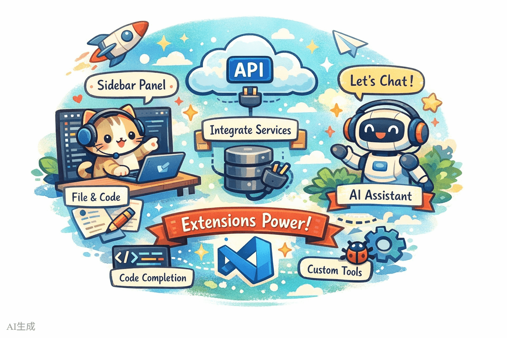
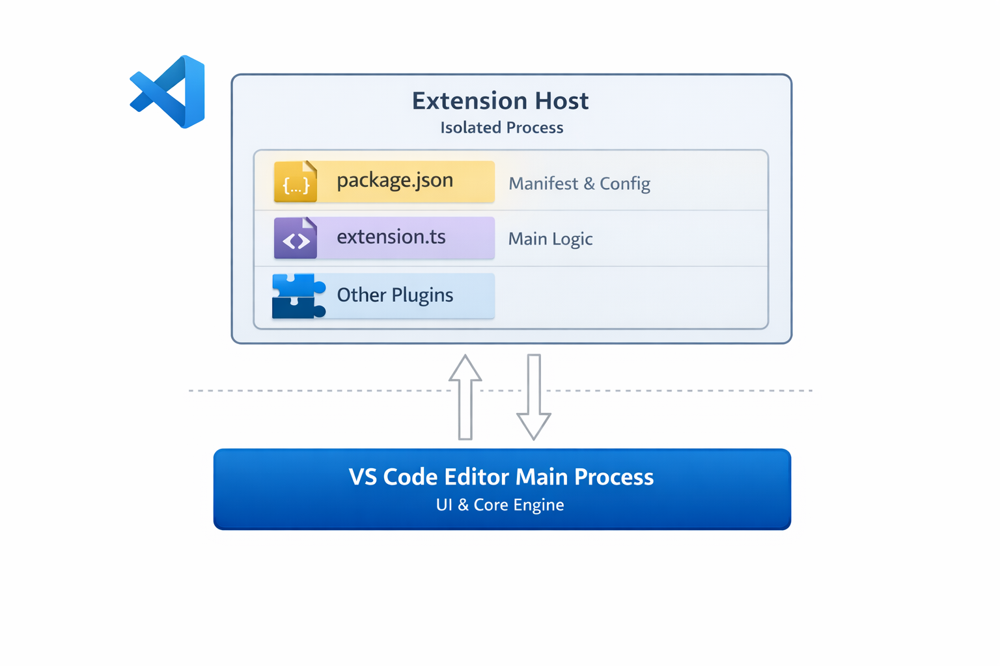
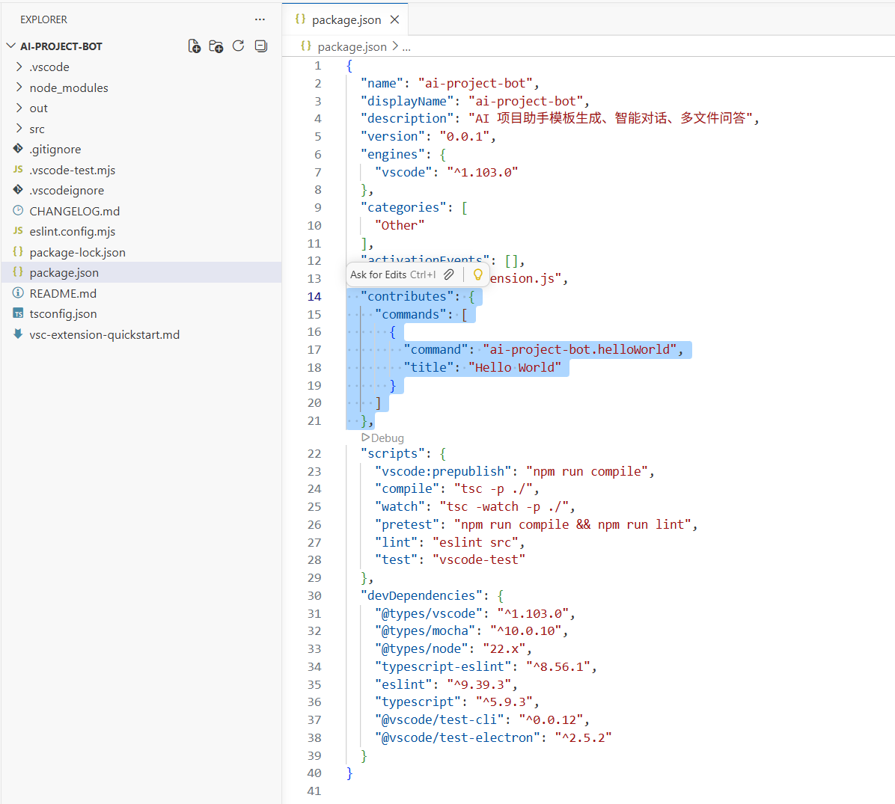
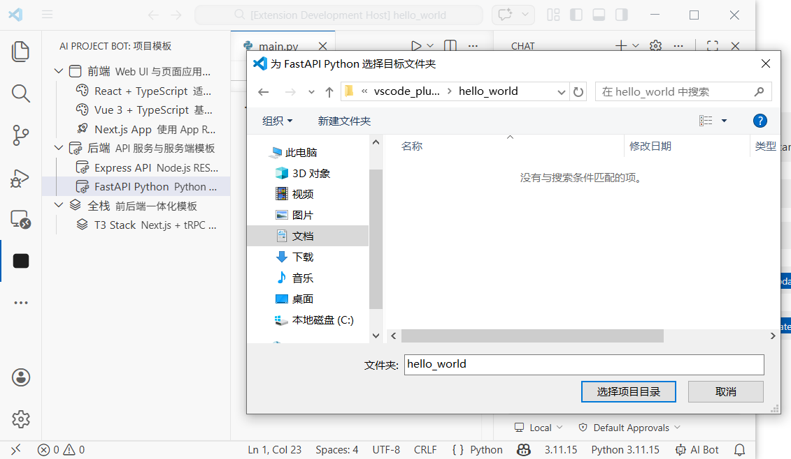
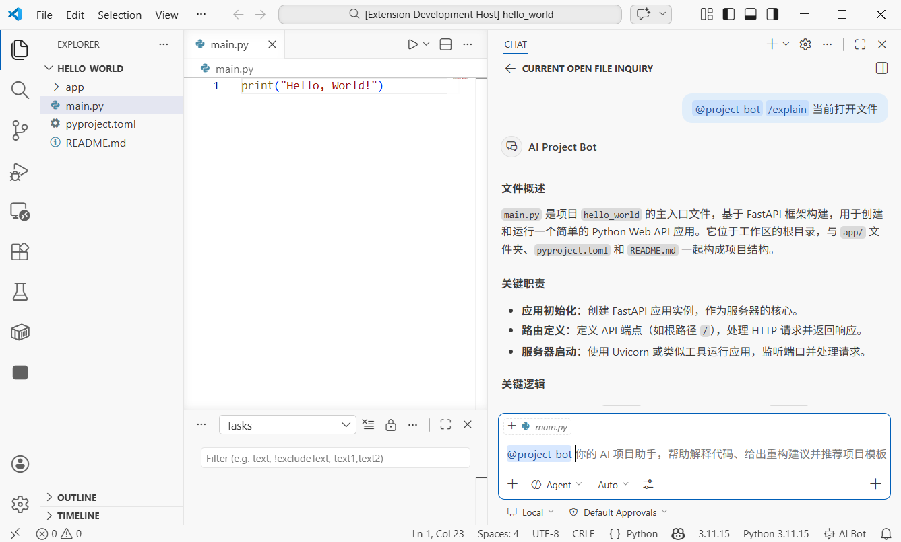
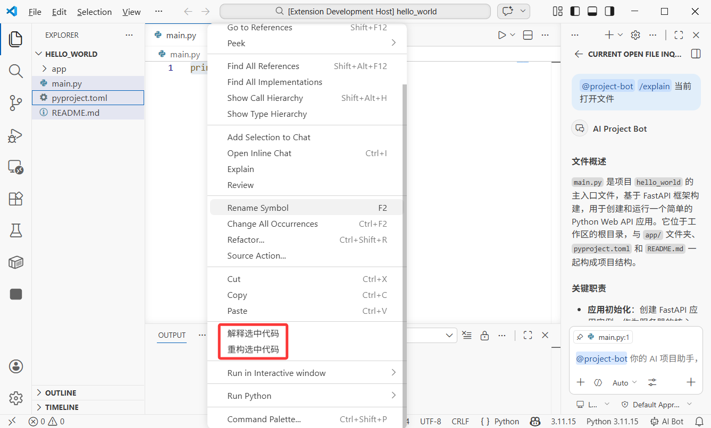

# How to Build a VS Code Extension: Create Your AI Project Assistant

# Chapter 1: What VS Code Extension Development Is

In this tutorial, we will complete a full closed loop: build a VS Code extension from scratch that acts as your AI project assistant, with one-click project template generation, AI chat on selected files or code snippets, multi-file Q&A analysis, and custom shortcuts. You will complete development, debugging, and learn how to publish to the VS Code Marketplace.

For this tutorial, you should at least have:

- Node.js environment (version 18.0+)
- VS Code editor (version 1.90+)
- Your AI coding assistant (Cursor / Trae / Claude Code)
- (Optional) GitHub Copilot subscription (for Language Model API)

> **Vibe Coding end-to-end**: we will use an AI coding assistant to generate most code. You only need to understand core concepts and architecture, then describe requirements in natural language.

## 1.1 What Can VS Code Extensions Do?

You already use VS Code extensions daily. Prettier formats your code, GitLens shows Git history, and GitHub Copilot helps you write code. These extensions are essentially programs written in TypeScript/JavaScript that extend the editor through VS Code APIs.

VS Code extensions can do much more than many people expect:

* **Add new UI elements**: sidebar panels, status bar info, custom Webview pages
* **Handle files and code**: read, modify, and create files; analyze code structure
* **Integrate external services**: call APIs, connect databases, integrate CI/CD
* **Extend editor capabilities**: custom language support, code completion, diagnostics
* **Add AI capabilities**: create AI assistants with Chat Participant API, call models with Language Model API

<!--  -->


## 1.2 Core Architecture of a VS Code Extension

A VS Code extension runs in an isolated **Extension Host** process, separate from the editor main process. This means even if an extension crashes, the editor itself is not affected.

A typical extension has these core parts:

* **package.json (manifest)**: extension "ID card," declaring name, entry file, contribution points (`commands`, `menus`, `keybindings`, etc.)
* **extension.ts (entry file)**: extension "brain," exporting `activate()` and `deactivate()`
* **Contribution Points**: what your extension contributes to VS Code in package.json (commands, menu items, keybindings, views, etc.)
* **VS Code API**: the TypeScript API set used to operate editor capabilities

```text
VS Code editor
    │
    ├── Extension Host (extension process)
    │   ├── Your extension
    │   │   ├── package.json  -> declares "what I can do"
    │   │   ├── extension.ts  -> implements "how to do it"
    │   │   └── other modules -> concrete feature code
    │   ├── Other extension A
    │   └── Other extension B
    │
    └── Editor main process (UI rendering)
```

<!--  -->


## 1.3 What Extension Are We Building?

We will build a VS Code extension named **"AI Project Bot"**, an AI project assistant with the following features:

| Feature | Description |
|------|------|
| Project templates | Sidebar list of templates, one-click project scaffold generation |
| AI chat | `@project-bot` participant in VS Code Chat for project Q&A |
| File/snippet chat | Right-click selected code or file and send to AI for analysis/explanation/refactoring |
| Multi-file Q&A | Multi-select files in explorer and ask AI to analyze relationships and logic |
| Shortcuts | Custom keybindings to trigger common actions quickly |

<!--  -->


## 1.4 Tutorial Roadmap

We will complete the flow in these steps:

1. **Create extension project** (3 minutes): scaffold project and understand core files
2. **Implement project templates** (5 minutes): use TreeView to show templates in sidebar and generate projects
3. **Implement AI Chat participant** (5 minutes): create `@project-bot` via Chat Participant API
4. **Implement file/snippet chat and multi-file Q&A** (5 minutes): right-click menus + multi-select analysis
5. **Add shortcuts and UX polish** (3 minutes): keybindings and status bar hints
6. **Publish to marketplace** (optional): package and submit

# Chapter 2: Create the Extension Project (3 Minutes)

## 2.1 Generate Project with Scaffold

VS Code officially provides a Yeoman scaffold tool. Ask AI to run:

```text
Please help me install VS Code extension scaffolding tools and create a project:
1. Install Yeoman and generator-code: npm install -g yo generator-code
2. Run yo code and choose:
   - Type: New Extension (TypeScript)
   - Name: ai-project-bot
   - Identifier: ai-project-bot
   - Description: AI project assistant - template generation, intelligent chat, multi-file Q&A
   - Package manager: npm
3. Enter project directory and install dependencies
```

Generated structure:

```text
ai-project-bot/
├── .vscode/
│   ├── launch.json          # Debug config (F5 starts debugging)
│   └── tasks.json           # Build tasks
├── src/
│   └── extension.ts         # Extension entry file
├── package.json             # Extension manifest (most important file)
├── tsconfig.json            # TypeScript config
└── vsc-extension-quickstart.md  # Quick start guide (can be removed)
```

## 2.2 Understand package.json: The Extension "ID Card"

`package.json` is the core file of a VS Code extension. Besides normal npm fields, it has `contributes` to declare everything your extension contributes to VS Code:

```json
{
  "name": "ai-project-bot",
  "displayName": "AI Project Bot",
  "description": "AI project assistant - template generation, intelligent chat, multi-file Q&A",
  "version": "0.0.1",
  "engines": { "vscode": "^1.90.0" },
  "activationEvents": [],
  "main": "./out/extension.js",
  "contributes": {
    "commands": [],
    "menus": {},
    "keybindings": [],
    "viewsContainers": {},
    "views": {},
    "chatParticipants": []
  }
}
```

**Key fields:**

| Field | Purpose |
|------|------|
| `engines.vscode` | Minimum supported VS Code version |
| `activationEvents` | When extension activates (empty means on-demand activation) |
| `main` | Path to compiled entry file |
| `contributes` | All contributed features (commands, menus, keybindings, views, etc.) |

<!--  -->


## 2.3 Understand extension.ts: The Extension "Brain"

Open `src/extension.ts` and you will see two core functions:

```typescript
import * as vscode from 'vscode'

// Called when extension is activated (first command execution, opening specific files, etc.)
export function activate(context: vscode.ExtensionContext) {
  console.log('AI Project Bot activated!')

  // Register commands, views, chat participants, etc.
  const disposable = vscode.commands.registerCommand(
    'ai-project-bot.helloWorld',
    () => {
      vscode.window.showInformationMessage('Hello from AI Project Bot!')
    }
  )

  context.subscriptions.push(disposable)
}

// Called when extension is deactivated (for example when VS Code closes)
export function deactivate() {}
```

**Core concepts:**

* `activate(context)`: extension initialization, register all capabilities here
* `context.subscriptions`: an auto-cleanup list; VS Code disposes registered items on deactivation
* `vscode.commands.registerCommand`: register command callable from command palette (`Ctrl+Shift+P`)

## 2.4 Start Debugging

Press **F5**, and VS Code opens a new **Extension Development Host** window. This is a fresh VS Code instance with your extension loaded.

In the new window, press **Ctrl+Shift+P**, type "Hello World," and you will see a message popup. This means your extension is running.

<!--  -->


> **Debug tip**: after code changes, in Extension Development Host press **Ctrl+Shift+P** -> **Developer: Reload Window** to reload extension quickly.

# Chapter 3: Implement Project Templates (5 Minutes)

## 3.1 Design Template System

We want to add a "Project Templates" panel in VS Code sidebar where users can browse templates and generate project skeletons with one click. This uses VS Code **TreeView API**.

Ask AI to implement:

```text
Please help me implement project templates in ai-project-bot:

1. Add contribution points in package.json:
   - Add a new viewsContainers.activitybar item with id "project-bot", title "AI Project Bot"
   - Add a view under it with id "projectTemplates", name "Project Templates"
   - Add command "ai-project-bot.createFromTemplate", title "Create Project from Template"

2. Create src/templates/templateProvider.ts:
   - Implement TreeDataProvider with template categories and templates:
     - Frontend: React + TypeScript, Vue 3 + TypeScript, Next.js App
     - Backend: Express API, FastAPI Python
     - Full-stack: T3 Stack (Next.js + tRPC + Prisma)
   - Each template item shows name, description, and icon

3. Create src/templates/scaffolder.ts:
   - Implement createProjectFromTemplate function
   - Let users choose target folder
   - Generate project structure by template type
```

## 3.2 Declare View in package.json

First add sidebar view contributions in `package.json`:

```json
{
  "contributes": {
    "viewsContainers": {
      "activitybar": [
        {
          "id": "project-bot",
          "title": "AI Project Bot",
          "icon": "resources/bot-icon.svg"
        }
      ]
    },
    "views": {
      "project-bot": [
        {
          "id": "projectTemplates",
          "name": "Project Templates"
        }
      ]
    },
    "commands": [
      {
        "command": "ai-project-bot.createFromTemplate",
        "title": "Create Project from Template",
        "icon": "$(add)"
      }
    ],
    "menus": {
      "view/title": [
        {
          "command": "ai-project-bot.createFromTemplate",
          "when": "view == projectTemplates",
          "group": "navigation"
        }
      ]
    }
  }
}
```

This config does three things:

1. Adds an "AI Project Bot" icon entry in the activity bar
2. Creates a "Project Templates" view under that entry
3. Adds a "+" button in the view title bar for project creation

<!--  -->


## 3.3 Implement TreeDataProvider

TreeDataProvider is the interface VS Code uses to fill tree data. We need `getTreeItem` (display info for one node) and `getChildren` (child node list).

Core code:

```typescript
// src/templates/templateProvider.ts
import * as vscode from 'vscode'

interface Template {
  name: string
  description: string
  category: string
  command: string // command to generate project, for example "npx create-react-app"
}

const TEMPLATES: Template[] = [
  { name: 'React + TypeScript', description: 'React project built with Vite', category: 'Frontend', command: 'npm create vite@latest {{name}} -- --template react-ts' },
  { name: 'Vue 3 + TypeScript', description: 'Vue 3 project built with Vite', category: 'Frontend', command: 'npm create vite@latest {{name}} -- --template vue-ts' },
  { name: 'Next.js App', description: 'Next.js App Router full-stack project', category: 'Frontend', command: 'npx create-next-app@latest {{name}} --typescript --app' },
  { name: 'Express API', description: 'Express + TypeScript REST API', category: 'Backend', command: 'npx create-express-api {{name}}' },
  { name: 'FastAPI Python', description: 'Python FastAPI backend project', category: 'Backend', command: 'pip install fastapi uvicorn' },
]

// Tree node: category or template
class TemplateItem extends vscode.TreeItem {
  constructor(
    public readonly label: string,
    public readonly collapsibleState: vscode.TreeItemCollapsibleState,
    public readonly template?: Template
  ) {
    super(label, collapsibleState)
    if (template) {
      this.description = template.description
      this.tooltip = `${template.name}\n${template.description}\nCommand: ${template.command}`
      this.contextValue = 'template'
      this.command = {
        command: 'ai-project-bot.createFromTemplate',
        title: 'Create Project',
        arguments: [template]
      }
    }
  }
}

export class TemplateProvider implements vscode.TreeDataProvider<TemplateItem> {
  getTreeItem(element: TemplateItem): vscode.TreeItem {
    return element
  }

  getChildren(element?: TemplateItem): TemplateItem[] {
    if (!element) {
      // Root: return category list
      const categories = [...new Set(TEMPLATES.map(t => t.category))]
      return categories.map(
        cat => new TemplateItem(cat, vscode.TreeItemCollapsibleState.Expanded)
      )
    }
    // Children: templates in category
    return TEMPLATES
      .filter(t => t.category === element.label)
      .map(t => new TemplateItem(t.name, vscode.TreeItemCollapsibleState.None, t))
  }
}
```

## 3.4 Register View and Create Command

Register TreeView and project creation command in `extension.ts`:

```typescript
// src/extension.ts
import { TemplateProvider } from './templates/templateProvider'

export function activate(context: vscode.ExtensionContext) {
  // Register template view
  const templateProvider = new TemplateProvider()
  vscode.window.registerTreeDataProvider('projectTemplates', templateProvider)

  // Register create project command
  const createCmd = vscode.commands.registerCommand(
    'ai-project-bot.createFromTemplate',
    async (template) => {
      if (!template) {
        // If no template passed (called from command palette), let user pick
        const pick = await vscode.window.showQuickPick(
          TEMPLATES.map(t => ({ label: t.name, description: t.description, template: t })),
          { placeHolder: 'Choose a project template' }
        )
        if (!pick) return
        template = pick.template
      }

      // Ask for project name
      const name = await vscode.window.showInputBox({
        prompt: 'Enter project name',
        placeHolder: 'my-awesome-project'
      })
      if (!name) return

      // Ask for target folder
      const folder = await vscode.window.showOpenDialog({
        canSelectFolders: true,
        openLabel: 'Select target folder'
      })
      if (!folder) return

      // Execute creation command
      const terminal = vscode.window.createTerminal('AI Project Bot')
      terminal.show()
      const cmd = template.command.replace('{{name}}', name)
      terminal.sendText(`cd "${folder[0].fsPath}" && ${cmd}`)

      vscode.window.showInformationMessage(`Creating ${template.name} project: ${name}`)
    }
  )

  context.subscriptions.push(createCmd)
}
```

Now press F5 for debugging. You will see AI Project Bot in activity bar. Expand template list and click any template to create a project.

<!--  -->


# Chapter 4: Implement AI Chat Participant (5 Minutes)

## 4.1 What Is Chat Participant API?

Starting from VS Code 1.90, extensions can create their own AI assistant in Chat panel using **Chat Participant API**. If user inputs `@project-bot help me analyze this project architecture`, your extension receives the message and returns model-generated response.

Core concepts:

* **Participant**: your assistant identity in Chat panel, invoked with `@name`
* **Slash Commands**: quick commands supported by participant, such as `/explain`, `/refactor`
* **Language Model API**: call built-in models in VS Code (for example Copilot GPT-4o)
* **Stream**: progressively output responses through `stream.markdown()`

## 4.2 Declare Chat Participant in package.json

Add this in `contributes`:

```json
{
  "contributes": {
    "chatParticipants": [
      {
        "id": "ai-project-bot.projectBot",
        "name": "project-bot",
        "fullName": "AI Project Bot",
        "description": "Your AI project assistant for code analysis, architecture explanation, and solution generation",
        "isSticky": true
      }
    ]
  }
}
```

`isSticky: true` means once selected, follow-up messages go to this participant by default, without typing `@project-bot` each time.

## 4.3 Implement Chat Participant Handler

Ask AI to write core logic:

```text
Please help me create src/chat/chatParticipant.ts and implement Chat Participant:
1. Register participant "ai-project-bot.projectBot"
2. Support three slash commands:
   - /explain: explain selected code or current file
   - /refactor: provide refactoring suggestions
   - /template: recommend suitable tech stack templates
3. Use Language Model API with VS Code built-in model
4. Return response in streaming mode (stream.markdown)
```

Core code:

```typescript
// src/chat/chatParticipant.ts
import * as vscode from 'vscode'

export function registerChatParticipant(context: vscode.ExtensionContext) {
  const participant = vscode.chat.createChatParticipant(
    'ai-project-bot.projectBot',
    async (request, chatContext, stream, token) => {
      // Select available model
      const models = await vscode.lm.selectChatModels({ family: 'gpt-4o' })
      const model = models[0]

      if (!model) {
        stream.markdown('No language model available. Please make sure GitHub Copilot is installed.')
        return
      }

      // Build system prompt by slash command
      let systemPrompt = 'You are a professional project development assistant.'

      if (request.command === 'explain') {
        systemPrompt = 'You are a code explanation expert. Please explain user code in concise Chinese, including purpose, logic flow, and key design decisions.'
      } else if (request.command === 'refactor') {
        systemPrompt = 'You are a code refactoring expert. Analyze user code and provide specific refactoring suggestions with improved code examples.'
      } else if (request.command === 'template') {
        systemPrompt = 'You are a tech stack selection expert. Recommend suitable tech stacks and project templates based on user requirements.'
      }

      // Build messages
      const messages = [
        vscode.LanguageModelChatMessage.User(systemPrompt),
        vscode.LanguageModelChatMessage.User(request.prompt)
      ]

      // Stream output
      const response = await model.sendRequest(messages, {}, token)
      for await (const chunk of response.stream) {
        stream.markdown(chunk)
      }

      return { metadata: { command: request.command || '' } }
    }
  )

  // Register slash commands
  participant.slashCommandProvider = {
    provideSlashCommands: () => [
      { name: 'explain', description: 'Explain code function and logic' },
      { name: 'refactor', description: 'Provide refactoring suggestions and improvements' },
      { name: 'template', description: 'Recommend suitable project templates and tech stacks' }
    ]
  }

  // Register follow-up suggestions
  participant.followupProvider = {
    provideFollowups: (result) => {
      if (result.metadata?.command === 'explain') {
        return [
          { prompt: 'Can you draw a flowchart?', label: 'Generate flowchart' },
          { prompt: 'Any potential bugs here?', label: 'Check potential issues' }
        ]
      }
      return []
    }
  }

  context.subscriptions.push(participant)
}
```

Call registration in `extension.ts`:

```typescript
import { registerChatParticipant } from './chat/chatParticipant'

export function activate(context: vscode.ExtensionContext) {
  // ... previous template registration code ...
  registerChatParticipant(context)
}
```

Now input `@project-bot /explain what does this code do?` in Chat panel, and your extension will call model and generate explanation.

<!--  -->


# Chapter 5: File/Snippet Chat and Multi-file Q&A (5 Minutes)

## 5.1 Right-click Menu: Send Selected Code to AI

We want users to select code in editor and send it to AI from context menu. This uses VS Code **Context Menu** contribution points.

Add in `package.json`:

```json
{
  "contributes": {
    "commands": [
      {
        "command": "ai-project-bot.explainSelection",
        "title": "AI: Explain Selected Code"
      },
      {
        "command": "ai-project-bot.refactorSelection",
        "title": "AI: Refactor Selected Code"
      }
    ],
    "menus": {
      "editor/context": [
        {
          "command": "ai-project-bot.explainSelection",
          "when": "editorHasSelection",
          "group": "ai-project-bot@1"
        },
        {
          "command": "ai-project-bot.refactorSelection",
          "when": "editorHasSelection",
          "group": "ai-project-bot@2"
        }
      ]
    }
  }
}
```

**Key config notes:**

* `when: "editorHasSelection"`: show menu only when text is selected
* `group: "ai-project-bot@1"`: menu grouping and order (`@1`, `@2`)

## 5.2 Implement Selected-code Analysis

```typescript
// src/commands/selectionCommands.ts
import * as vscode from 'vscode'

export function registerSelectionCommands(context: vscode.ExtensionContext) {
  // Explain selected code
  const explainCmd = vscode.commands.registerCommand(
    'ai-project-bot.explainSelection',
    async () => {
      const editor = vscode.window.activeTextEditor
      if (!editor) return

      const selection = editor.selection
      const selectedText = editor.document.getText(selection)
      const fileName = editor.document.fileName.split('/').pop()
      const startLine = selection.start.line + 1
      const endLine = selection.end.line + 1

      // Build prompt with context
      const prompt = [
        `Please explain the following code (from ${fileName}, lines ${startLine}-${endLine}):`,
        '```',
        selectedText,
        '```',
        'Please explain: 1) what this code does 2) core logic 3) possible improvements'
      ].join('\n')

      // Call Language Model API
      const models = await vscode.lm.selectChatModels({ family: 'gpt-4o' })
      if (!models.length) {
        vscode.window.showErrorMessage('No language model available')
        return
      }

      // Show results in output panel
      const outputChannel = vscode.window.createOutputChannel('AI Project Bot')
      outputChannel.show()
      outputChannel.appendLine(`\n--- Code Explanation (${fileName}:${startLine}-${endLine}) ---\n`)

      const messages = [
        vscode.LanguageModelChatMessage.User(prompt)
      ]
      const response = await models[0].sendRequest(messages, {})
      for await (const chunk of response.stream) {
        outputChannel.append(chunk)
      }
    }
  )

  context.subscriptions.push(explainCmd)
}
```

<!--  -->


## 5.3 Multi-file Q&A: Batch Analyze File Relationships

This is one of the most powerful features: multi-select files in explorer and let AI analyze relationship and logic in one click.

Add explorer context menu in `package.json`:

```json
{
  "contributes": {
    "commands": [
      {
        "command": "ai-project-bot.analyzeFiles",
        "title": "AI: Analyze Relationships of Selected Files"
      }
    ],
    "menus": {
      "explorer/context": [
        {
          "command": "ai-project-bot.analyzeFiles",
          "when": "explorerResourceIsFile",
          "group": "ai-project-bot"
        }
      ]
    }
  }
}
```

Implement multi-file analysis command:

```typescript
// src/commands/multiFileAnalysis.ts
import * as vscode from 'vscode'

export function registerMultiFileCommands(context: vscode.ExtensionContext) {
  const analyzeCmd = vscode.commands.registerCommand(
    'ai-project-bot.analyzeFiles',
    async (clickedFile: vscode.Uri, selectedFiles: vscode.Uri[]) => {
      // selectedFiles contains all selected files
      const files = selectedFiles || [clickedFile]

      if (files.length < 2) {
        vscode.window.showWarningMessage('Please select at least 2 files for analysis')
        return
      }

      // Read all selected files
      const fileContents: string[] = []
      for (const file of files) {
        const content = await vscode.workspace.fs.readFile(file)
        const fileName = vscode.workspace.asRelativePath(file)
        fileContents.push(
          `--- ${fileName} ---\n${Buffer.from(content).toString('utf8')}`
        )
      }

      const prompt = [
        `Please analyze relationships among these ${files.length} files:`,
        '',
        ...fileContents,
        '',
        'Please explain:',
        '1. Responsibilities of each file',
        '2. Dependency/call relationships among them',
        '3. Data flow (if any)',
        '4. Architectural suggestions or potential issues'
      ].join('\n')

      // Call model and show result
      const models = await vscode.lm.selectChatModels({ family: 'gpt-4o' })
      if (!models.length) {
        vscode.window.showErrorMessage('No language model available')
        return
      }

      const outputChannel = vscode.window.createOutputChannel('AI Project Bot')
      outputChannel.show()
      outputChannel.appendLine(`\n--- Multi-file Analysis (${files.length} files) ---\n`)

      const messages = [
        vscode.LanguageModelChatMessage.User(prompt)
      ]
      const response = await models[0].sendRequest(messages, {})
      for await (const chunk of response.stream) {
        outputChannel.append(chunk)
      }
    }
  )

  context.subscriptions.push(analyzeCmd)
}
```

Usage: in explorer, hold `Ctrl` (`Cmd` on Mac) to multi-select files, right-click and choose "AI: Analyze Relationships of Selected Files." AI reads all selected files and returns analysis.

<!--  -->


# Chapter 6: Shortcuts and UX Optimization (3 Minutes)

## 6.1 Custom Keybindings

Shortcuts are key to efficiency. Add in `package.json`:

```json
{
  "contributes": {
    "keybindings": [
      {
        "command": "ai-project-bot.explainSelection",
        "key": "ctrl+shift+e",
        "mac": "cmd+shift+e",
        "when": "editorTextFocus && editorHasSelection"
      },
      {
        "command": "ai-project-bot.refactorSelection",
        "key": "ctrl+shift+r",
        "mac": "cmd+shift+r",
        "when": "editorTextFocus && editorHasSelection"
      },
      {
        "command": "ai-project-bot.createFromTemplate",
        "key": "ctrl+shift+n",
        "mac": "cmd+shift+n",
        "when": ""
      }
    ]
  }
}
```

**`when` conditions:**

| Condition | Meaning |
|------|------|
| `editorTextFocus` | Cursor is in editor |
| `editorHasSelection` | Some text is selected |
| `explorerViewletVisible` | Explorer panel is visible |
| `!editorReadonly` | File is not read-only |

Multiple conditions connected by `&&` mean all must be satisfied.

## 6.2 Status Bar Hint

Add a quick status bar entry so users always know extension is running:

```typescript
// src/statusBar.ts
import * as vscode from 'vscode'

export function createStatusBarItem(context: vscode.ExtensionContext) {
  const statusBar = vscode.window.createStatusBarItem(
    vscode.StatusBarAlignment.Right,
    100
  )
  statusBar.text = '$(hubot) AI Bot'
  statusBar.tooltip = 'Click to open AI Project Bot'
  statusBar.command = 'ai-project-bot.createFromTemplate'
  statusBar.show()

  context.subscriptions.push(statusBar)
}
```

`$(hubot)` is VS Code built-in icon syntax. You can find all icons in [Codicon library](https://microsoft.github.io/vscode-codicons/dist/codicon.html).

<!--  -->


# Chapter 7: Publish to Marketplace (Optional)

## 7.1 Prepare for Publishing

VS Code extensions are packaged and published with **vsce**:

```text
Please help me install vsce: npm install -g @vscode/vsce
```

Before publishing, prepare:

1. **Azure DevOps account**: register and create an organization at [dev.azure.com](https://dev.azure.com/)
2. **Personal Access Token (PAT)**: create in Azure DevOps with permission **Marketplace -> Manage**
3. **Publisher ID**: create publisher identity in [VS Code Marketplace](https://marketplace.visualstudio.com/manage)

## 7.2 Improve package.json Metadata

Add metadata before publishing:

```json
{
  "publisher": "your-publisher-id",
  "repository": {
    "type": "git",
    "url": "https://github.com/yourname/ai-project-bot"
  },
  "categories": ["AI", "Other"],
  "keywords": ["ai", "project", "template", "chat"],
  "icon": "resources/icon.png",
  "galleryBanner": {
    "color": "#1e1e2e",
    "theme": "dark"
  }
}
```

You also need a `README.md` for marketplace description and a `CHANGELOG.md` for version history.

## 7.3 Package and Publish

```bash
# Package to .vsix (manual install file)
vsce package

# Publish to marketplace
vsce publish
```

After packaging, you get `ai-project-bot-0.0.1.vsix`. You can send this file to friends and they can install via VS Code "Install from VSIX."

For official marketplace publishing, run `vsce publish`; the extension usually appears within minutes.

<!--  -->

> **Tip**: first release may require review. Make sure README is clear and screenshots are complete to speed up approval.

# Chapter 8: Final Notes

Congratulations! You have built a fully functional VS Code extension from scratch. Recap:

1. Created extension project with Yeoman scaffold and understood roles of `package.json` and `extension.ts`
2. Implemented sidebar project template list with TreeView API and one-click project creation
3. Created `@project-bot` AI assistant with Chat Participant API, including slash commands and streaming responses
4. Implemented right-click code selection analysis
5. Implemented multi-file relationship analysis
6. Added custom shortcuts and status bar hint

The imagination space of VS Code extension development is huge. The tech behind the useful extensions you use every day is exactly what you just learned.

**Advanced directions:**

* **Custom Webview panels**: build fully custom UI with HTML/CSS/JS, such as visual architecture graphs and interactive code review interfaces
* **Language Model Tools**: register custom tools callable by AI, such as querying database or executing API requests
* **Diagnostics and CodeLens**: show AI suggestions, performance hints, and security warnings inline
* **Custom language support**: provide syntax highlighting, completion, and diagnostics for DSLs or specific config formats
* **Remote development integration**: make extension work in SSH, containers, and WSL

***Your editor, your rules.***

# References

* [VS Code Extension API Docs](https://code.visualstudio.com/api)
* [Chat Participant API Guide](https://code.visualstudio.com/api/extension-guides/chat)
* [Language Model API Guide](https://code.visualstudio.com/api/extension-guides/language-model)
* [TreeView API Guide](https://code.visualstudio.com/api/extension-guides/tree-view)
* [Webview API Guide](https://code.visualstudio.com/api/extension-guides/webview)
* [VS Code Extension Publishing Guide](https://code.visualstudio.com/api/working-with-extensions/publishing-extension)
* [Codicon Icon Library](https://microsoft.github.io/vscode-codicons/dist/codicon.html)
