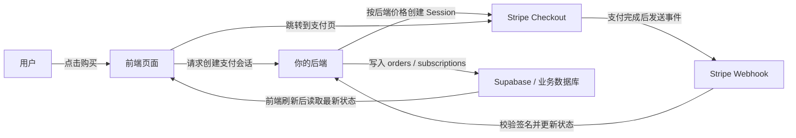
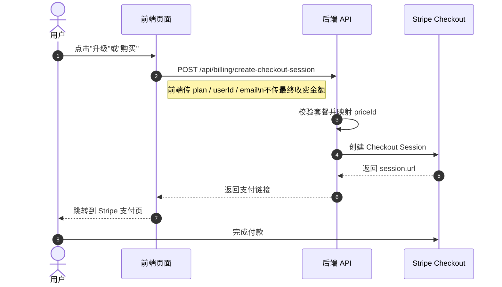
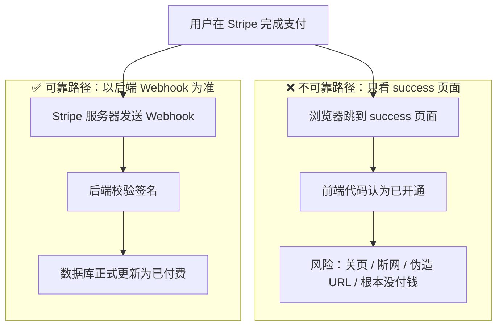
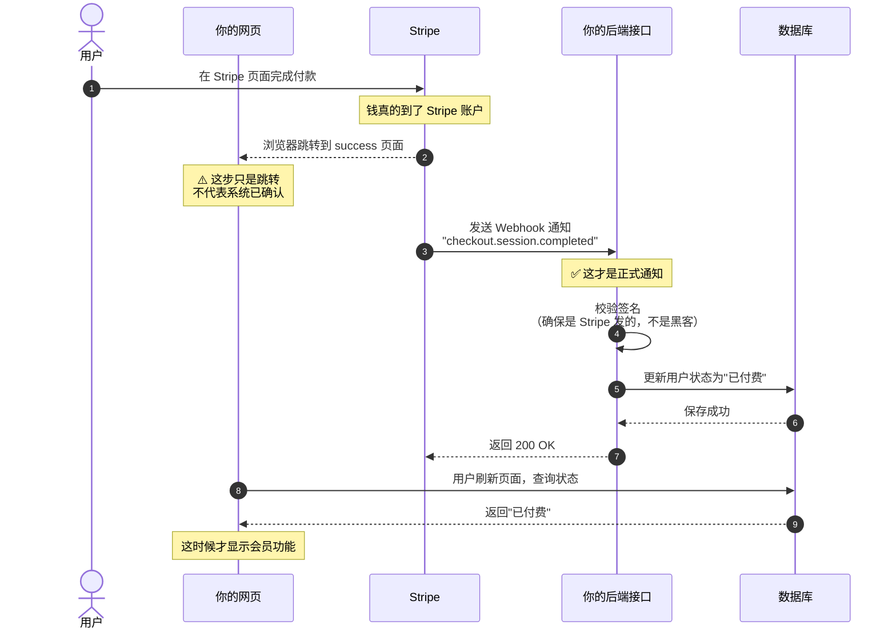
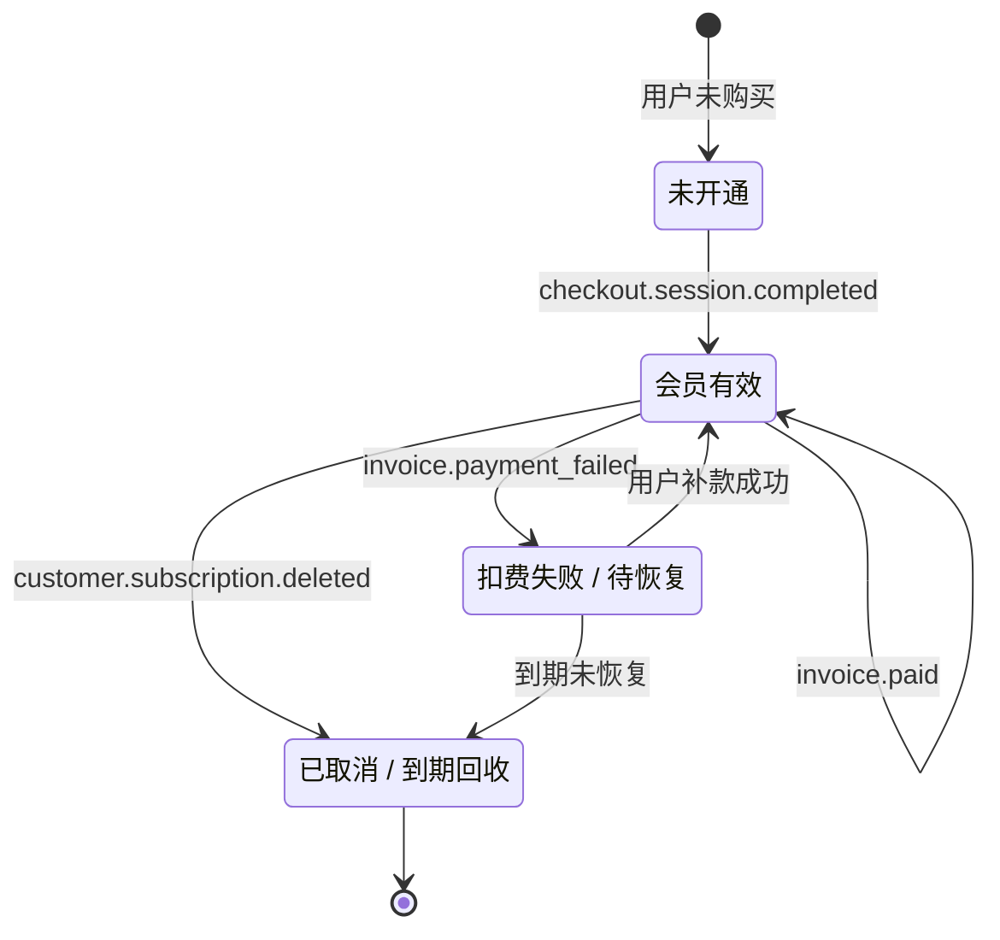
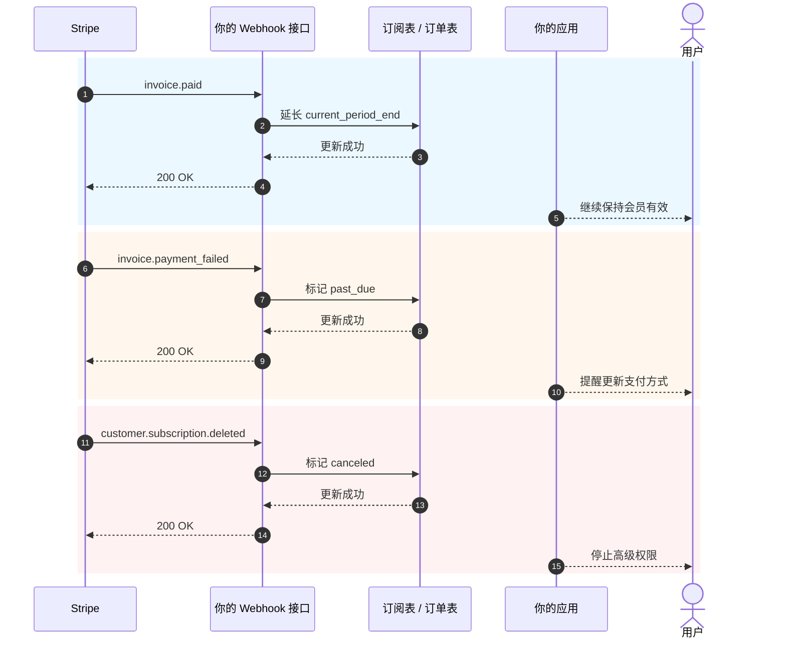

# 如何集成 Stripe 等收费系统

当你的产品已经有了页面、登录、数据库和基础后端之后，下一个现实问题就是：**怎么收费**。

很多人第一次接支付，会把注意力全放在"怎么跳转到付款页"上。但真正决定系统是否稳定的，不是按钮，而是整条收费链路：谁决定价格、谁确认支付成功、谁更新数据库、谁回收权限。

这篇文章我帮你拆成两部分：

- **前半部分**只讲最实用的基础接入，目标是让你尽快把 Stripe 接进项目。
- **后半部分**统一放到附录，包含 Webhook 细节、订阅事件、不同国家和地区的支付方案差异。

> 💡 建议先学完这些章节再继续
>
> - [从数据库到 Supabase](../2.2-database-supabase/)
> - [大模型辅助编写接口代码与接口文档](../2.3-ai-interface-code/)
> - [如何部署 Web 应用](../2.5-zeabur-deployment/)

# 你将学到

1. 最小可行的支付系统到底长什么样。
2. 如何用最快的方式把 Stripe 接进你的项目。
3. 如何写提示词，让 AI 直接帮你加支付系统。
4. 如果不是做海外 Stripe 项目，不同地区应该优先考虑什么支付方案。

---

# 第一部分：基础上手

## 1. 先记住 3 个原则

如果你只记住三件事，就记住下面这三条：

1. **价格必须由后端决定**，不能相信前端传来的金额。
2. **真正让权限生效的是 Webhook**，不是 `success` 页面。
3. **你自己的数据库必须保存支付状态**，不能只依赖 Stripe 后台。

这三条是支付系统最核心的边界。只要边界没错，后面换 Stripe、PayPal、支付宝、微信支付，本质上都只是"接口换了，架构不变"。

## 2. 如果不在后端处理，而是前端直接连 Stripe，会怎么样？

这是很多人第一次做支付时最自然的想法：

- 页面上已经有"购买"按钮了
- 那我能不能让前端自己去连 Stripe
- 这样是不是就不用做后端了

如果你只是做一个假的演示页面，这样想当然没问题。  
但如果你是真的要收钱，**这条路通常会把事情做坏**。

最常见的问题有这几个：

1. **价格容易被改**
   浏览器里的请求，是用户自己电脑上发出去的。别人是可以改请求内容的。
2. **敏感信息容易暴露**
   真正重要的密钥、价格逻辑、会员开通逻辑，本来就不该放在前端。
3. **你没法可靠确认"这笔钱到底算不算成功"**
   用户跳到成功页，不代表你的数据库已经同步对了。
4. **数据库状态会乱**
   用户可能说"我明明已经付钱了"，但你自己的系统里根本没记上。

所以更安全的分工应该是：

- 前端负责：展示按钮、发起购买、跳转页面
- 后端负责：决定价格、创建支付会话、接收 Webhook、更新数据库

::: info 这一段你可以直接记成一句话
**前端可以负责跳转，后端必须负责定价和确认。**

只要是真收钱，就不要把"最终价格决定权"和"支付成功后的开通逻辑"放在前端。
:::

## 3. 什么时候适合先用 Stripe

如果你做的是下面这些场景，Stripe 往往是最顺手的起点：

- 面向海外用户的 SaaS
- 订阅制会员产品
- 数字产品、模板、AI 积分包
- 想先快速验证商业化，而不是一开始就处理太多本地支付细节

如果你的主要用户在中国大陆，那通常不会把 Stripe 当第一选择，这个我放到附录里统一讲。

## 4. 最小可行支付链路

先看最小版本。只要这条链路能跑通，你的支付系统就有了骨架。



把它翻译成人话就是：

1. 用户点按钮。
2. 前端找后端要支付链接。
3. 后端用 Stripe 密钥创建支付会话。
4. 用户去 Stripe 页面付款。
5. Stripe 把"付款真的成功了"这件事通过 Webhook 通知你。
6. 你的后端再去更新数据库。

## 5. 发起付款的标准时序图

如果你习惯看更规范的系统图，可以直接看这张时序图：



## 6. 快速开始

如果你想最快把它接进项目，照着下面这 5 步做就够了。

### 6.1 第一步：在 Stripe 后台创建商品和价格

这一步的目的，不是"先随便配点东西"，而是先把 **你到底在卖什么、打算怎么收费** 这件事在 Stripe 里定义清楚。

在 Stripe 的模型里：

- **Product** 表示"你卖的是什么"，比如 `Pro 会员`
- **Price** 表示"这个东西卖多少钱、按什么周期卖"，比如 `月付 9.9 美元`、`年付 99 美元`

为什么要先做这一步？  
因为后面当你的后端创建 Checkout Session 时，并不是直接传一个金额给 Stripe，而是要传一个已经存在的 `price_id`。Stripe 再根据这个 `price_id` 去生成真正的支付页、金额、币种和订阅周期。

如果你跳过这一步，后面的"创建支付链接"其实就没法做。

::: info 为什么这里要先停一下
很多新手看到 `Product`、`Price` 这两个词会有点烦，觉得像是在学 Stripe 的内部术语。

但实际上，这一步是在做一件很朴素的事：
- 把"卖什么"定义清楚
- 把"卖多少钱"定义清楚
- 让后端之后能拿一个稳定的 `price_id` 去创建支付链接

只要把这层想明白，后面的 Checkout Session 就不会觉得抽象。
:::

对于一个最小可行的订阅系统，你至少先建这两个层级：

- 一个 `Product`
- 一个或多个 `Price`

你可以直接打开这些页面：

- Stripe Dashboard 登录页：[Dashboard Login](https://dashboard.stripe.com/login)
- Stripe 商品与价格管理文档：[Manage products and prices](https://docs.stripe.com/products-prices/manage-prices)
- Stripe Checkout 快速开始文档：[Build a Stripe-hosted checkout page](https://docs.stripe.com/checkout/quickstart?lang=node)
- Stripe Dashboard 商品页：[Product catalog](https://dashboard.stripe.com/test/products)

推荐你先在 **Test mode（测试模式）** 下操作，不要一开始就在正式环境里建。

一个最常见的最小配置是：

- `Product`: `Pro Plan`
- `Price 1`: `pro_monthly`
- `Price 2`: `pro_yearly`

你在后台操作时，可以按这个顺序理解：

1. 先创建一个商品 `Pro Plan`
2. 再在这个商品下面挂两个价格
3. 月付和年付其实是同一个商品的两种收费方式

完成后，你至少要记下这些信息：

- 月付价格的 `price_id`
- 年付价格的 `price_id`
- 你自己的套餐名，例如 `pro_monthly`、`pro_yearly`

如果你是第一次进 Stripe 后台，建议你把这一步理解成：

- `Product` 决定支付页里卖的是什么
- `Price` 决定支付页里收多少钱
- 后端之后真正会用到的，主要是 `price_id`

::: info 真正要记下来的值
这一页里最重要的不是商品名称，而是 `price_id`。

后面无论是让 AI 帮你接后端，还是你自己排查问题，真正会频繁用到的，通常都是：
- `STRIPE_PRICE_PRO_MONTHLY`
- `STRIPE_PRICE_PRO_YEARLY`
- 它们背后对应的两个 `price_id`
:::

如果你想让 AI 先带你把后台配置做完，可以直接用这个 prompt：

```text
我现在是第一次用 Stripe，你先不要改代码，先带我在 Stripe 后台把最基本的付费配置做好。

请基于这些官方文档给我一步一步的操作说明：
- https://docs.stripe.com/products-prices/manage-prices
- https://docs.stripe.com/checkout/quickstart?lang=node

我的情况是：
- 我想做一个最简单的会员付费
- 只有两个套餐：月付和年付
- 我现在还不懂 Product、Price 这些词

请你：
1. 先用最简单的话告诉我 Product 和 Price 分别是什么。
2. 再按"先打开哪个页面 -> 点哪里 -> 填什么"的顺序教我操作。
3. 最后提醒我，做完以后我需要从后台复制哪些内容给后端使用。
4. 如果我容易走错，请顺便提醒我应该一直在测试模式里操作。
```

### 6.2 第二步：准备环境变量

你通常至少需要准备这些环境变量：

- `STRIPE_SECRET_KEY`
- `STRIPE_WEBHOOK_SECRET`
- `STRIPE_PRICE_PRO_MONTHLY`
- `STRIPE_PRICE_PRO_YEARLY`
- `APP_URL`
- `SUPABASE_URL`
- `SUPABASE_SERVICE_ROLE_KEY`

你可以直接打开这些页面：

- Stripe API Keys 文档：[API keys](https://docs.stripe.com/keys)
- Stripe Dashboard API Keys 页面：[API Keys](https://dashboard.stripe.com/test/apikeys)
- Stripe Webhooks 文档：[Receive Stripe events in your webhook endpoint](https://docs.stripe.com/webhooks)
- Stripe Dashboard Webhooks 页面：[Workbench Webhooks](https://dashboard.stripe.com/test/workbench/webhooks)

> ⚠️ `STRIPE_SECRET_KEY` 和 `SUPABASE_SERVICE_ROLE_KEY` 都只能放在后端。

::: info 环境变量这一步的目的
这一步不是为了"先把 `.env` 填满"，而是为了把支付系统里最敏感的几样东西放到后端保管：

- Stripe 的后端密钥
- Webhook 验签密钥
- 你自己的价格映射

简单理解：  
前端只负责发起购买，真正的秘密和定价逻辑都应该留在服务端。
:::

这一步也可以直接让 AI 帮你整理：

```text
请你先看看我这个项目现在是怎么放环境变量的，然后帮我把 Stripe 需要的环境变量整理出来。

请参考这些文档：
- https://docs.stripe.com/keys
- https://docs.stripe.com/webhooks

我的情况是：
- 我是零基础
- 我分不清哪些变量应该放前端，哪些应该放后端
- 我也不确定当前项目应该改 `.env`、`.env.local` 还是别的文件

请你：
1. 先搜索当前项目里环境变量通常写在哪。
2. 帮我列出 Stripe 接入最少需要哪些变量。
3. 用最简单的话告诉我每个变量是干什么的。
4. 告诉我每个变量应该去哪一个 Stripe 页面复制。
5. 如果项目里有示例环境变量文件，请直接帮我补上变量名。
```

### 6.3 第三步：后端创建 Checkout Session

这一步你不用自己写接口，直接让 AI 参考官方文档帮你实现。

先把这些文档给它：

- Stripe Checkout 快速开始：[Build a Stripe-hosted checkout page](https://docs.stripe.com/checkout/quickstart?lang=node)
- Checkout Sessions API：[Create a Checkout Session](https://docs.stripe.com/api/checkout/sessions/create)
- 订阅说明：[Subscriptions](https://docs.stripe.com/payments/subscriptions)

然后直接贴这个 prompt：

```text
请你先看看我当前项目的后端代码是怎么组织的，然后帮我把 Stripe 支付接进去。

请参考这些官方文档：
- https://docs.stripe.com/checkout/quickstart?lang=node
- https://docs.stripe.com/api/checkout/sessions/create
- https://docs.stripe.com/payments/subscriptions

我的目标很简单：
- 用户点购买按钮后，能跳到 Stripe 的付款页面
- 套餐只有月付和年付两种
- 不要让我自己决定代码该放在哪，你先看项目再帮我放到合适的位置

请你：
1. 先搜索项目，弄清楚后端入口文件、路由文件、环境变量写法分别在哪里。
2. 再参考官方文档，帮我把"创建 Stripe 支付链接"这一步接进去。
3. 不要让我自己传金额，价格请用后端环境变量来决定。
4. 做完后告诉我你改了哪些文件。
5. 最后告诉我，我还需要去 Stripe 后台补哪些配置。
```

### 6.4 第四步：前端跳转到支付页

这一步的目标非常简单：让定价页按钮调用你的后端接口，再跳转到 Stripe Checkout。

参考文档：

- Stripe Checkout 集成说明：[Build an integration with Checkout](https://docs.stripe.com/payments/checkout/build-integration)

给 AI 的 prompt：

```text
帮我把项目里的"购买"按钮接上 Stripe。

要求：
- 不动现有页面，只改按钮点击后的逻辑
- 点击后调用后端接口获取支付链接，然后跳转到 Stripe
- 如果出错，给用户一个简单提示（比如"支付暂时不可用，请稍后再试"）

参考文档：https://docs.stripe.com/payments/checkout/build-integration
```

### 6.5 第五步：Webhook 更新数据库状态

这是最关键的一步。

::: info 为什么这一步最关键
很多人会以为"用户付完款并且跳转到了 success 页面"就算完成了。

不是。

对你的系统来说，真正重要的是：  
**Stripe 有没有正式把事件打到你的 Webhook，而你的后端有没有把数据库状态更新成功。**
:::

你也可以让 AI 按 Stripe 官方 Webhook 文档直接实现，不要自己手写。

参考文档：

- Stripe Webhooks：[Receive Stripe events in your webhook endpoint](https://docs.stripe.com/webhooks)
- Stripe CLI：[Stripe CLI](https://docs.stripe.com/stripe-cli)
- Stripe CLI 用法：[Use the Stripe CLI](https://docs.stripe.com/stripe-cli/use-cli)

给 AI 的 prompt：

```text
请继续帮我把 Stripe 的"付款成功后自动生效"这一步接好。

请参考这些官方文档：
- https://docs.stripe.com/webhooks
- https://docs.stripe.com/stripe-cli
- https://docs.stripe.com/stripe-cli/use-cli

我的目标是：
- 用户付完钱后，不只是跳转到成功页面
- 而是真的把我数据库里的会员状态改成已开通

请你：
1. 先搜索当前项目里数据库相关代码和用户状态是怎么存的。
2. 再帮我加 Stripe webhook。
3. 支付成功后，把对应用户改成 active，或者更新成项目里现在已经在用的会员状态字段。
4. 如果项目里已经有订阅表、订单表、用户表，请优先沿用现有结构。
5. 做完后告诉我你改了哪些文件。
6. 顺便告诉我本地怎么测试这一步有没有真的生效。
```

## 7. 让 AI 帮你快速接入的提示词

如果你用的是 Codex、Claude Code、Trae、Cursor 一类工具，可以直接把下面这个提示词贴给它，让它在你的项目里做支付接入。

```text
请你帮我把当前项目接上 Stripe 支付，我希望做一个最简单能跑起来的会员收费功能。

我的要求：
1. 我是零基础，请你先自己看项目，再决定代码应该改哪里。
2. 不要让我自己判断目录结构、路由结构、数据库结构。
3. 我只想先做最简单版本：月付和年付两个套餐。
4. 用户点击购买后，能跳到 Stripe 付款页面。
5. 付款成功后，我数据库里的会员状态能变成已开通。
6. 不要一开始加太多复杂功能，比如优惠券、升级降级、复杂发票。

输出要求：
1. 先给我一个改动计划。
2. 然后直接修改代码。
3. 最后告诉我怎么一步一步本地测试。
4. 如果有哪个步骤还需要我去 Stripe 后台操作，请直接把链接和要点告诉我。
```

如果你希望 AI 更贴近你的项目，还可以在开头补上：

- 你的前端框架
- 你的后端目录结构
- 你的数据库表名
- 你现在的用户系统是 Supabase Auth 还是自建 Auth

## 7.1 本地联调也尽量交给 AI

如果你希望连本地联调都让 AI 帮你串起来，可以直接用下面这段：

```text
请继续帮我把 Stripe 支付真正跑通，我想一步一步照着做，不想自己猜。

请参考官方文档：
- https://docs.stripe.com/webhooks
- https://docs.stripe.com/stripe-cli
- https://docs.stripe.com/stripe-cli/use-cli

我的目标：
1. 告诉我先打开哪些 Stripe 页面。
2. 告诉我如何拿到 STRIPE_WEBHOOK_SECRET。
3. 告诉我如何使用 stripe login 和 stripe listen。
4. 告诉我怎样验证 checkout.session.completed 已经成功打到本地 webhook。
5. 如果当前项目需要先启动前端和后端，也请顺带告诉我具体命令。
6. 不要只讲原理，请按实际操作步骤输出。
7. 如果我某一步做错了，也请告诉我最常见的报错会长什么样。
```

## 8. 最容易踩坑的 4 件事

1. **把 `success` 页面当成支付成功**
   真正决定状态的是 Webhook，不是前端跳转。
2. **让前端传金额**
   这会带来严重的价格篡改风险。
3. **Webhook 路由被 `express.json()` 提前处理**
   Stripe 验签需要原始请求体。
4. **没有做幂等处理**
   Webhook 可能重试，如果你每次都重复加会员或积分，就会出事故。

## 9. 一句话选型建议

如果你现在只是想先把收费跑起来：

| 你的主要用户 | 最先尝试的方案 |
| :--- | :--- |
| 海外 SaaS / 国际用户 | Stripe |
| 中国大陆用户 | 支付宝 / 微信支付 |
| 香港或跨境团队 | Stripe + 本地钱包 / FPS 聚合方案 |

后面的具体区别，我统一放到附录。

::: info 最简单的选型思路
不要一开始就想"我要把全球支付方式一次全接完"。

更实际的顺序通常是：
- 先按主要用户所在地区选一条主支付链路
- 先把最小可行支付跑通
- 再根据真实用户来源补第二、第三种支付方式
:::

## 10. 小结

到这里，你已经掌握了最基础但最重要的一条收费链路：

1. 前端发起购买。
2. 后端创建 Checkout Session。
3. 用户在 Stripe 页面支付。
4. Stripe 通过 Webhook 通知后端。
5. 后端更新数据库。
6. 前端刷新后显示新的会员或订单状态。

如果你只想快速把支付接进项目，前面的内容已经够用了。下面的附录你可以在真正遇到问题时再回来看。

---

# 附录

## 附录 A：Stripe 里最常见的几个对象

第一次看 Stripe 文档，最容易被这些对象名绕晕。你其实只需要先理解下面几个：

| 对象 | 作用 | 你可以把它理解成什么 |
| :--- | :--- | :--- |
| `Product` | 描述卖的是什么 | 商品或会员套餐 |
| `Price` | 描述卖多少钱、周期怎么收费 | 月付、年付、买断 |
| `Checkout Session` | Stripe 托管的支付流程 | 付款页 |
| `Subscription` | 周期订阅关系 | 自动续费会员 |
| `Customer` | 付款用户 | Stripe 中的客户档案 |
| `Webhook` | 异步通知 | Stripe 告诉你"这笔款怎么样了" |

## 附录 B：为什么 `success` 页面不等于支付成功

很多人以为"用户付完钱，跳到了 success 页面"就算支付成功了。这是最容易踩的坑。

### 先讲一个真实场景

假设你做了一个会员网站：
1. 用户点击"购买会员"
2. 跳转到 Stripe 付款页面
3. 用户输入信用卡，点击付款
4. 页面跳转到你的 `success.html`
5. 你在 success 页面写代码："既然到了这页，就给用户开通会员"

**问题在哪？**

用户可能根本没付钱，或者付到一半关页面了，也能直接访问 `success.html`。

### 两条完全不同的路径



**关键区别：**

| | success 页面跳转 | Webhook 通知 |
| :--- | :--- | :--- |
| 谁发起的 | 用户的浏览器 | Stripe 的服务器 |
| 能伪造吗 | 能，直接访问 URL 就行 | 不能，有签名验证 |
| 一定代表付款成功吗 | 不一定 | 一定 |
| 你的系统怎么知道 | 前端代码猜的 | Stripe 正式通知的 |

### 完整流程应该是怎样的



### 每个环节的卡点

**第 1 步：用户在 Stripe 付款**

这是唯一确定"钱真的付了"的时刻：
- 用户输入信用卡信息，点击确认
- 银行从用户卡里扣款
- Stripe 确认收到这笔钱

**第 2 步：浏览器跳转到 success 页面（问题最大）**

这一步完全不可靠，因为：
- 用户可以直接在浏览器输入 `yoursite.com/success`，根本没付钱也能访问
- 用户付到一半关页面了，但之前复制了 success 链接，之后直接打开
- 网络问题导致跳转失败，但钱已经扣了（用户付了钱却没看到成功页面）
- 用户点返回键，又付了一次钱，但两次都跳转到同一个 success 页面

**第 3 步：Stripe 发送 Webhook**

这是 Stripe 主动通知你的服务器"这笔款到账了"：
- 只有 Stripe 的服务器能发起这个请求
- 请求里带有签名，你的后端可以验证是不是真的 Stripe 发的
- 即使 success 页面没打开、用户断网了，Webhook 也会发送

**第 4 步：后端校验签名**

为什么要校验？防止黑客伪造通知。

假设没有校验，黑客可以直接给你的服务器发一个假通知："用户 A 付了 1000 元"。你的系统就会给黑客开通会员。

校验的过程：
- Stripe 用你们约定的密钥对通知内容生成签名
- 你的后端用同样的密钥验证签名是否匹配
- 匹配 = 100% 是 Stripe 发的，不匹配 = 直接拒绝

**第 5 步：更新数据库**

只有校验通过后，才更新数据库：
- 把用户状态从"待付款"改成"已付费"
- 记录订单号、金额、付款时间
- 开通对应的会员权限

**第 6 步：前端查询状态**

success 页面不要自己判断"到了这页就是成功了"。正确的做法：
- 页面加载时，向后端发送请求："这个用户付费了吗？"
- 后端查数据库，返回真实状态
- 根据返回结果显示"开通成功"或"等待确认"

### 一个常见的错误做法

```javascript
// 错误：在 success 页面直接开通
// success.html
if (window.location.pathname === '/success') {
  // 危险！任何人都能访问 /success
  activateMembership();
}
```

```javascript
// 正确：每次刷新都查后端
// success.html
async function checkStatus() {
  const response = await fetch('/api/user/status');
  const data = await response.json();
  
  if (data.paymentStatus === 'paid') {
    showMemberFeatures();
  } else {
    showPendingMessage();
  }
}
```

### 总结一句话

**success 页面只是"浏览器跳转成功"，Webhook 才是"Stripe 正式确认收款"。**

你的系统必须以 Webhook 为准，不能相信前端的跳转。

## 附录 C：订阅系统最值得监听的事件

| 事件 | 含义 | 你通常要做什么 |
| :--- | :--- | :--- |
| `checkout.session.completed` | 首次开通成功 | 创建本地订阅记录 |
| `invoice.paid` | 自动续费成功 | 延长有效期 |
| `invoice.payment_failed` | 自动扣费失败 | 标记风险状态并提醒用户 |
| `customer.subscription.deleted` | 订阅取消 | 回收权限或标记到期后失效 |

### 订阅状态图



### 续费 / 失败 / 取消时序图



## 附录 D：其他支付方案怎么选

### 1. 中国大陆

主要用户在大陆的话，首选还是 **[支付宝](https://open.alipay.com/)** 和 **[微信支付](https://pay.wechatpay.cn/)**。

**业务模式：**

两者都是"支付网关"模式。你需要：
- 申请商户资质（营业执照、对公账户）
- 用户付的钱直接到你的商户账户
- 你自己负责税务、退款、对账

**技术模式：**

两者都是"后端下单 + 前端调起 + 后端通知"的模型，跟 Stripe 思路一样。

**支付宝接入流程：**
1. 在支付宝开放平台创建应用
2. 配置公私钥和回调地址
3. 后端调用统一下单接口，生成支付链接或二维码
4. 用户扫码或跳转付款
5. 支付宝异步通知你的后端，更新订单状态

**微信支付接入流程：**
- JSAPI 支付：适合公众号、小程序，用户在微信内直接付款
- Native 支付：PC 端生成二维码，用户扫码付款
- H5 支付：手机浏览器内拉起微信 App 付款

流程：后端下单 → 拿到 `prepay_id` 或 `code_url` → 前端调起支付 → 后端接收通知确认成功

**参考链接：**
- 支付宝开放平台：https://open.alipay.com/
- 微信支付商户文档：https://pay.wechatpay.cn/doc/v3/merchant/

### 2. 香港

香港市场比较混合，常见组合：

- 银行卡：Visa / Mastercard
- FPS（转数快）：香港本地即时转账
- AlipayHK / WeChat Pay HK：香港版支付宝和微信

**推荐组合：**
- 用 **[Stripe](https://stripe.com/hk)** 覆盖国际卡和订阅
- 用 **[Airwallex](https://www.airwallex.com/)** 或 **[Adyen](https://www.adyen.com/)** 补本地钱包和 FPS

### 3. 海外 / 国际 SaaS

#### [Stripe](https://stripe.com/)

**业务模式：** 支付网关

- 你需要自己申请商户资质（部分国家 Stripe 可以帮你搞定）
- 用户付的钱到你的 Stripe 账户，再结算到你的银行账户
- 你自己负责税务申报

**技术模式：**

- API 体验最好，文档清晰
- 支持 Checkout（托管页面）、Elements（自定义表单）、Payment Links（无代码）
- Webhook 通知支付状态
- 支持订阅、发票、多币种

**适合谁：** 海外 SaaS、独立开发者、需要灵活定制的团队

**参考链接：** https://docs.stripe.com/

#### [PayPal](https://www.paypal.com/)

**业务模式：** 支付网关

- 用户付的钱到你的 PayPal 账户，再提现到银行
- 你自己负责税务

**技术模式：**

- 一次性支付：前端放按钮，后端创建/确认订单
- 订阅制：先建 Product 和 Plan，再用 SDK 拉起
- 同样需要后端和 Webhook，不要只看前端回调

**适合谁：** 需要补充渠道的海外业务，用户习惯用 PayPal 付款

**参考链接：** https://developer.paypal.com/docs/

#### [Paddle](https://www.paddle.com/)

**业务模式：** Merchant of Record (MoR)

- Paddle 是"记录商家"，法律上由 Paddle 向用户收款
- Paddle 帮你处理全球税务、VAT、退款、合规
- 用户付的钱到 Paddle，Paddle 扣除税费和手续费后结算给你
- 你不需要在每个国家注册公司或处理税务

**技术模式：**

- Paddle.js：前端嵌入托管结账页
- 后端 API：创建 transaction，交给 checkout 处理
- Webhook 同步订阅状态

**适合谁：** 不想处理全球税务的 SaaS 团队，尤其是 B2B SaaS

**参考链接：** https://developer.paddle.com/

#### [Lemon Squeezy](https://www.lemonsqueezy.com/)

**业务模式：** Merchant of Record (MoR)

- 和 Paddle 类似，Lemon Squeezy 是"记录商家"
- 帮你处理全球税务、VAT、合规
- 2024 年被 Stripe 收购，但独立运营

**技术模式：**

- Hosted Checkout：最简单，直接生成付款链接
- Checkout Overlay：浮层嵌入你的页面
- 后端 API：创建 checkout，灵活控制

**适合谁：** 独立开发者、数字产品、软件授权

**参考链接：** https://docs.lemonsqueezy.com/

### 4. 企业级方案

#### [Airwallex（空中云汇）](https://www.airwallex.com/)

**业务模式：** 支付网关 + 全球账户

- 提供全球收款账户（类似虚拟银行账户）
- 支持多币种收款、换汇、付款
- 你自己负责税务

**技术模式：**

- Payment Links：几乎不用代码，生成付款链接
- Hosted Payment Page：托管页面
- Drop-in / Embedded / Native API：深度接入，自定义程度高
- 支持 Alipay HK、FPS、WeChat Pay 等本地支付方式

**适合谁：** 香港团队、跨境业务、需要多币种账户的公司

**参考链接：** https://www.airwallex.com/docs/

#### [Adyen](https://www.adyen.com/)

**业务模式：** 支付网关

- 企业级支付平台，年处理交易额万亿欧元
- 支持线上、线下、移动端全渠道
- 你自己负责税务

**技术模式：**

- Pay by Link：最简单，生成付款链接
- Drop-in / Components：标准线上接入
- 后台可启用 Alipay、Alipay HK、PayMe 等本地支付方式

**适合谁：** 大型企业、需要全渠道支付的公司

**参考链接：** https://docs.adyen.com/

### 5. 方案对比

| 方案 | 业务模式 | 税务处理 | 适合谁 |
| :--- | :--- | :--- | :--- |
| Stripe | 支付网关 | 自己处理 | 海外 SaaS、开发者 |
| PayPal | 支付网关 | 自己处理 | 海外补充渠道 |
| Paddle | MoR | Paddle 代处理 | B2B SaaS、不想管税务 |
| Lemon Squeezy | MoR | LS 代处理 | 独立开发者、数字产品 |
| Adyen | 支付网关 | 自己处理 | 大型企业 |
| Airwallex | 支付网关 + 账户 | 自己处理 | 跨境业务、香港团队 |
| 支付宝/微信 | 支付网关 | 自己处理 | 大陆用户 |

### 6. 按地区选方案

| 你的市场 | 推荐方案 |
| :--- | :--- |
| 中国大陆 | 支付宝 / 微信支付 |
| 香港 | Stripe + Airwallex / Adyen |
| 海外 SaaS | Stripe（自己管税务）或 Paddle（MoR 代管） |
| 海外数字产品 | Stripe / Lemon Squeezy / Paddle |
| 多地区企业级 | Adyen / Airwallex / Stripe 组合 |
