# 快速上手利用大模型生成设计

## 第 1 章：1 分钟生成第一份图片素材

在开始讨论设计、风格或提示词之前，我们先用最少的步骤生成第一张图片。

### 1.1 认识 NanoBanana

在开始讨论设计风格、提示词工程之前，我们先解决一件更重要的事：**确认你真的可以生成一张图片。**

当前主流的大模型已经具备图像生成与编辑能力，这类模型通常被称为**生成式模型。**

为了把流程尽量简化，本教程选择了一个已经具备稳定图像生成与编辑能力的模型作为示例——NanoBanana。它是 Google 推出的图像生成模型，正式名称为  **Gemini 3.1 Flash Image Preview** ，支持通过自然语言直接生成图片，也支持在已有图片基础上进行修改。


在能力层面，它和你可能听说过的其他模型（如 GPT-4o、Claude、Qwen、Midjourney 等）并没有本质区别：**输入描述，模型负责生成结果。**

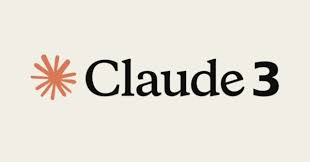

你可以把它理解为一支“画笔”。我们在这一章只关心一件事：
 👉 **这支画笔能不能在你手里画出第一笔。**

在实际使用中，NanoBanana 可以通过 **Google AI Studio** 等官方平台直接使用，也可以通过 **API** 的方式集成到开发流程中。本教程采用 API 调用方式。现在还推出了NanoBanana 2模型，你可以使用最新的大模型进行尝试。

### 1.2 “Hello World” 级别的生成

在开始之前，你只需要完成下面三步：

1. 在 Trae 中新建一个文件夹

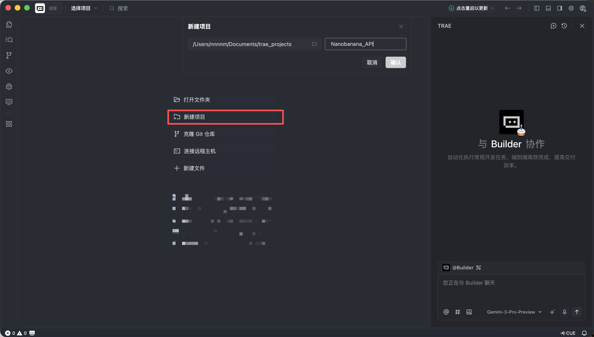

2. 新建一个 Python 文件


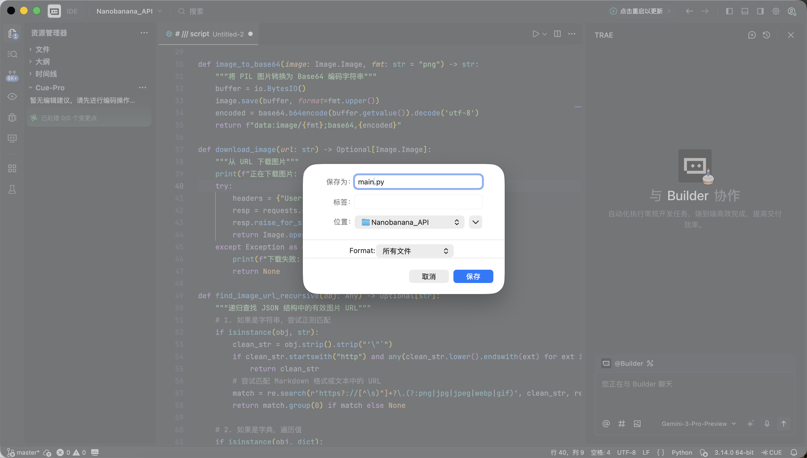

3. 将下面的代码完整粘贴进去

Trae 会自动完成所需的环境部署与依赖安装，不需要额外配置。

代码中会用到 NanoBanana 的 API Key。这里不展开申请流程——只要你能获取并填入对应参数即可。**这一阶段不追求理解每一行代码，只要它能成功运行。**

```Python
# /// script
# dependencies = [
#  "gradio>=4.0.0",
#  "pillow>=10.0.0",
#  "requests>=2.31.0",
# ]
# ///

import gradio as gr
import requests
import base64
from PIL import Image
import io
import os
import time
import re
from typing import Optional, Dict, Any, List

# 配置 API 信息
NANOBANANA_API_URL: str = "YOUR API URL"
NANOBANANA_API_KEY: str = "YOUR API KEY"
OUTPUT_DIR: str = "outputs"

# 确保输出目录存在
os.makedirs(OUTPUT_DIR, exist_ok=True)

def image_to_base64_data_uri(image: Image.Image) -> str:
    """
    将 PIL 图像转换为 OpenAI API 兼容的 data URI 格式。
    """
    buffer = io.BytesIO()
    # 统一转为 PNG 以保证兼容性
    image.save(buffer, format="PNG")
    encoded = base64.b64encode(buffer.getvalue()).decode('utf-8')
    return f"data:image/png;base64,{encoded}"

def base64_to_image(base64_str: str) -> Optional[Image.Image]:
    """
    将纯 base64 字符串转换为 PIL Image。
    """
    try:
        image_bytes = base64.b64decode(base64_str)
        return Image.open(io.BytesIO(image_bytes))
    except Exception as e:
        print(f"Base64 解码失败: {e}")
        return None

def extract_base64_from_response(content: Any) -> Optional[str]:
    """
    核心解析逻辑：从 API 返回的 content 中提取图片 Base64 数据。
    兼容 Markdown 格式和结构化列表格式。
    """
    if not content:
        return None

    base64_data = None

    # 1. 尝试结构化提取 (List)
    # 对应返回格式: [{"type": "image_url", "image_url": {"url": "data:..."}}]
    if isinstance(content, list):
        for part in reversed(content):  # 倒序查找，通常最新的图片在最后
            if isinstance(part, dict):
                # 检查 image_url 或 output_image 字段
                img_field = part.get("image_url") or part.get("image") or part.get("output_image")
                if isinstance(img_field, dict):
                    url = img_field.get("url", "")
                    if url.startswith("data:image/") and "," in url:
                        return url.split(",", 1)[1].strip()

        # 如果列表中没有结构化图片，尝试把列表里的文本拼起来找 Markdown
        text_parts = [
            str(p.get("text", ""))
            for p in content
            if isinstance(p, dict) and p.get("type") in ["text", "input_text"]
        ]
        content_str = "".join(text_parts)
    else:
        content_str = str(content)

    # 2. 尝试 Markdown 正则提取 (String)
    # 对应返回格式: "Here is your image: "
    pattern = re.compile(r"!\[.*?\]\((data:image/[^;]+;base64,[^)]+)\)", re.IGNORECASE)
    match = pattern.search(content_str)

    if match:
        data_url = match.group(1)
        if "," in data_url:
            return data_url.split(",", 1)[1].strip()

    return None

def synthesize(prompt: str, input_image: Optional[Image.Image]) -> Optional[Image.Image]:
    """
    调用 Nanobanana API 进行生成。
    """
    if not prompt or not prompt.strip():
        gr.Warning("请输入提示词")
        return None

    print(f">>> 开始任务: {prompt[:50]}...")

    headers = {
        "Content-Type": "application/json",
        "Authorization": f"Bearer {NANOBANANA_API_KEY}"
    }

    # 构造符合 OpenAI Vision / Chat 标准的 payload
    messages = []

    if input_image is not None:
        # 图生图/多模态输入模式
        print(">>> 检测到输入图片，使用多模态模式")
        img_base64 = image_to_base64_data_uri(input_image)
        messages.append({
            "role": "user",
            "content": [
                {"type": "text", "text": prompt},
                {"type": "image_url", "image_url": {"url": img_base64}}
            ]
        })
    else:
        # 纯文生图模式
        messages.append({
            "role": "user",
            "content": prompt
        })

    payload = {
        "messages": messages,
        # 使用第一段代码中验证可用的模型
        "model": "gemini-2.5-flash-image",
        # 可选参数，视 API 支持情况而定
        "stream": False
    }

    try:
        # 增加超时时间，图片生成通常较慢
        response = requests.post(NANOBANANA_API_URL, headers=headers, json=payload, timeout=120)

        # 检查 HTTP 状态
        if response.status_code != 200:
            error_msg = f"API 请求失败: {response.status_code} - {response.text}"
            print(error_msg)
            gr.Error(error_msg)
            return None

        result = response.json()
        # Debug: 打印返回结果的前一部分，方便调试
        print(f"API 原始响应 (截取): {str(result)[:200]}...")

        # 提取 Content
        content = None
        if "choices" in result and len(result["choices"]) > 0:
            content = result["choices"][0].get("message", {}).get("content")

        if not content:
            gr.Warning("API 返回结果中没有 content 字段")
            return None

        # 使用之前验证过的逻辑提取 Base64
        base64_str = extract_base64_from_response(content)

        if base64_str:
            output_image = base64_to_image(base64_str)
            if output_image:
                return output_image

        # 如果没提取到图片，可能是模型拒绝了或只返回了文本
        text_content = str(content) if not isinstance(content, list) else " ".join([str(x) for x in content])
        gr.Info(f"未生成图片，模型返回文本: {text_content[:100]}...")
        return None

    except requests.exceptions.Timeout:
        gr.Error("请求超时，请稍后重试")
        return None
    except Exception as e:
        import traceback
        traceback.print_exc()
        gr.Error(f"发生未知错误: {str(e)}")
        return None

# Gradio 界面配置
with gr.Blocks(title="Nanobanana Image Generator") as app:
    gr.Markdown("# 🍌 Nanobanana Text/Image to Image")
    gr.Markdown("基于 Gemini-2.5-Flash-Image 模型，支持文生图与图生图。")

    with gr.Row():
        with gr.Column():
            prompt_input = gr.Textbox(
                label="提示词 (Prompt)",
                placeholder="例如: A cyberpunk cat holding a neon sign...",
                lines=3
            )
            image_input = gr.Image(
                label="参考图 (可选，用于图生图)",
                type="pil",
                height=300
            )
            submit_btn = gr.Button("开始生成", variant="primary")

        with gr.Column():
            image_output = gr.Image(label="生成结果", format="png")

    submit_btn.click(
        fn=synthesize,
        inputs=[prompt_input, image_input],
        outputs=image_output
    )

if __name__ == "__main__":
    app.launch(share=True)
```

当 Trae 提示运行成功后，点击它提供的本地链接（通常是 http://127.0.0.1:7860）。


如果一切正常，你会看到一个已经可以工作的 AI 绘图界面。

这个界面看起来很简单，但它已经具备了商业级绘图工具中最核心的两项能力，即文生图和图生图。

* **左侧：** **指令区 (** **Input** Zone) —— 你在这里发号施令。
* **Prompt (提示词框)：** 输入你的创意描述（推荐使用英文）。
* **Input** Image (参考图框)：
  * **文生图模式：** 保持此处 **为空** 。
  * **图生图模式：** 将本地图片拖入此处，AI 会以它为基础进行创作。
* **Submit 按钮：** 点击即可发送指令，开始生成。
* **右侧：展示区 (** **Output** Zone) —— 见证奇迹的地方，生成结果将在此显示。


现在我们可以尝试生成你的第一张图片了！

本示例使用的 prompt 如下：

> **A red apple**

这是一个刻意简化的示例，不包含任何风格或参数描述。

#### 实际流程

运行代码后，流程可以概括为三步：

1. 将文字描述发送给模型
2. 模型生成对应图片
3. 图片被保存为本地文件

几秒钟后，你会在本地看到生成结果。而模型生成具有随机性，所以相同的prompt会有不同的生成结果，你可以多次生成，选择你心仪的图片。


也可以丰富你的提示词，给予它更多的描述和限定。例如以下提示词，得到的图片就会更加特殊一些。

```Plain
"A hyper-realistic close-up of a fresh red apple with water droplets on its skin, sitting on a dark rustic wooden table. Cinematic dramatic lighting, rim light, shallow depth of field, bokeh background, 8k resolution, macro photography."
(一个超写实的带水珠的新鲜红苹果特写，放在深色粗糙木桌上。电影级戏剧光效，轮廓光，浅景深，背景虚化，8k分辨率，微距摄影。)
```


在Output Image区域点击下载图片即可保存到本地。

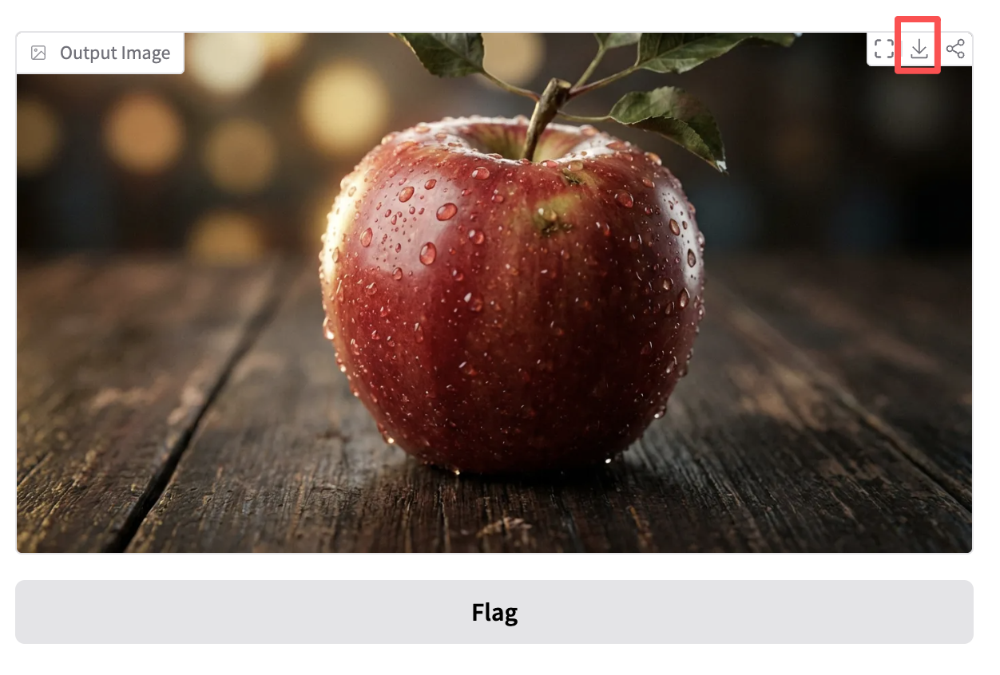

### 1.3 生图模型常见的素材生成场景

在实际工作中，大模型生成图片更多用于 **高效产出设计素材** ，而不是创作单张艺术作品。

当你观察一些设计类营销账号的高赞案例时会发现，它们的产出大多集中在两类场景：

* **文生图（从 0 到 1）**
* **有图参考生图（从 1 到 N）**

#### 一、文生图：快速获取设计物料

这一类场景关注效率。当需要填补设计中的空白（如空状态、头像、配图）时，AI 本质上充当的是一个 **即时生成的图库** 。

1. ##### 生成 UI 设计物料

* 流行趋势：Dribbble 上常见的毛玻璃、黏土风 3D 图标
* 常见表现：通透材质、边缘发光、糖果配色的功能或天气图标

**示例 Prompt：**

> A set of 3D weather icons (sun, cloud, rain), glassmorphism style, frosted glass texture, soft pastel gradient colors, soft studio lighting, isometric view, transparent background, 4k.

（一套 3D 天气图标，毛玻璃风格，磨砂质感，柔和渐变色，影棚光，等轴视图）


2. ##### 生成 Logo

* 流行趋势：极简线条、几何组合的科技感 Logo
* 常见表现：黑白配色、负空间设计、品牌感明确

**示例 Prompt：**

> Minimalist vector logo design for a tech brand "Coffee Code", combining a coffee cup with coding brackets < >, flat design, solid black lines, white background, Paul Rand style, svg.

（极简矢量 Logo，结合咖啡杯与代码符号，扁平设计，纯黑线条）

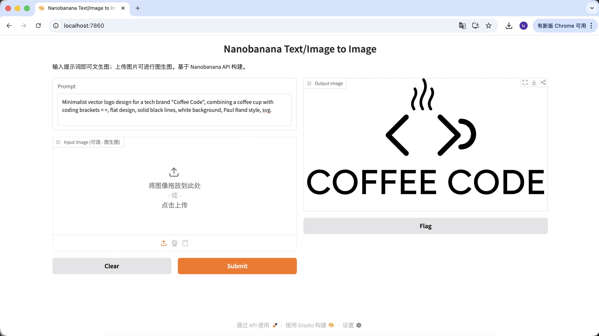

3. ##### 生成官网用户图片

* 流行趋势：SaaS 官网常用 3D 虚拟头像，用于规避真人版权
* 常见表现：友好表情、卡通比例、偏 Pixar 或 Memoji 风格

**示例 Prompt：**

> Close-up portrait of a friendly young tech professional, smiling, Memoji 3D style, clay render, bright colors, soft lighting, solid plain background, Pixar character design.

（友好的年轻科技从业者，3D Memoji 风格，黏土渲染）

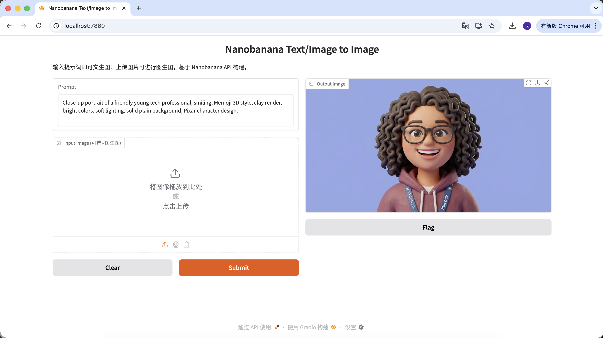

4. ##### 生成文章配图

* 流行趋势：科技公司博客中常见的抽象扁平插画
* 常见表现：紫蓝配色、夸张人物比例、漂浮 UI 元素

**示例 Prompt：**

> Editorial flat illustration representing remote work, a person sitting on a giant globe using a laptop, corporate memphis art style, vibrant colors (purple and teal), vector texture.

（远程办公主题扁平插画，企业孟菲斯风格）

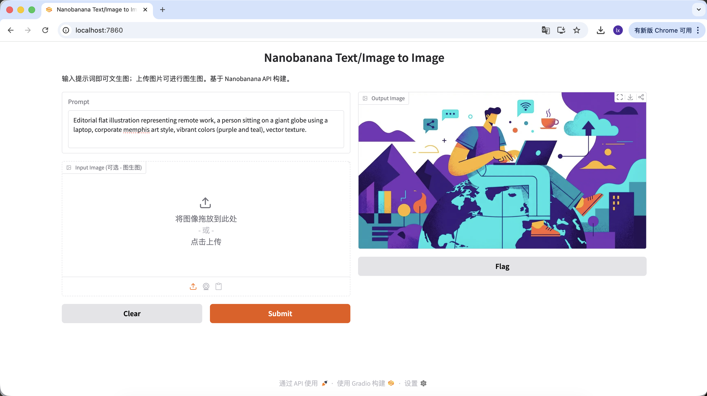

#### 二、有图参考生图：保持视觉一致性

这一类场景更关注 **扩展性** 。当你已经有一张满意的主视觉，需要生成一整套风格一致的素材时使用。

5. ##### 主视觉相似的一套按钮或交互素材图

在游戏开发中，UI 的一致性非常关键。假设你已经有了主界面的 **“PLAY”** 按钮，现在需要扩展出一整套风格统一的功能按钮（如暂停、设置、主页）。仅靠手绘很难保证每个按钮在光泽、透视和色值上的完全一致。

**基本操作流程：**

1. 保存已有的蓝色 “PLAY” 按钮图片


2. 将其拖入界面的 **Input**** Image** 区域，作为后续生成的参考母版
3. 保持 prompt 中的风格描述不变，仅修改主体内容

在这一流程下，只要替换主体描述，就可以得到不同功能但风格一致的按钮。

**示例 Prompt：**

**变体 A：暂停按钮（图标类）**

> A capsule-shaped game UI button with a white pause icon (two vertical bars) inside. Same glossy blue jelly style, shiny plastic texture, white thick outline, vector illustration, high quality.

（胶囊形游戏 UI 按钮，白色暂停图标，蓝色果冻质感）


**变体 B：设置按钮（复杂图标）**

> A capsule-shaped game UI button with a white gear icon (settings symbol) inside. Same glossy blue jelly style, shiny plastic texture, white thick outline, vector illustration, high quality.

（胶囊形游戏 UI 按钮，白色齿轮图标，蓝色果冻质感）

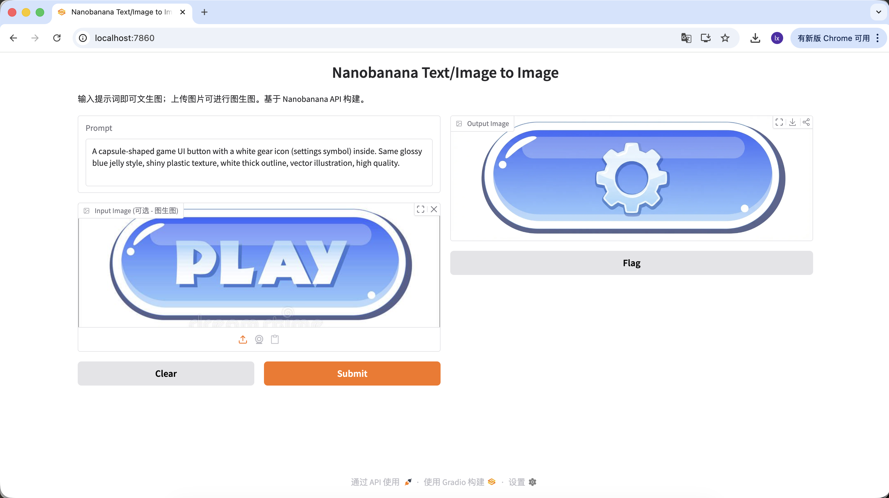

**变体 C：重玩按钮（形状变化）**

如果需要调整按钮外形，可以在 prompt 中直接描述形状，模型会在保留材质特征的同时尝试改变结构。

> A round game UI button with a white circular arrow icon (replay symbol) inside. Same glossy blue jelly style, shiny plastic texture, white thick outline, vector illustration, high quality.

（圆形游戏 UI 按钮，循环箭头图标，蓝色果冻质感）


通过这一组操作，你不仅可以替换按钮功能和图标，甚至改变按钮形状，但所有生成结果在材质、配色和光影上仍保持高度一致。这正是大模型在设计素材裂变场景中的核心价值。

## 第 2 章：更听话的图像生成助手 —— 以 Lovart 为例

在第一部分，我们通过代码直接调用 NanoBanana，体验了“输入即生成”的基础流程。这种方式在需求简单时没有问题。但当生成任务开始包含更多约束，例如：

* 需要多张风格一致的图片
* 需要在已有结果上反复调整
* 需要根据用户输入动态修改生成方向

单次调用的方式就会逐渐变得不够用。

这时，就需要引入  **AI Agent（**  **智能体**  **）** 。本节以 **Lovart** 为例，展示当图像生成模型具备“思考层”后，整体工作流会发生怎样的变化。注意！这里不是打广告，只是帮助大家快速get到AI Agent的便捷性～

### 2.0 初识 Lovart：你的 AI 设计代理

Lovart 是一个基于 Agent 的设计工具 Web。相比普通生图工具，它在生成之前多了一层“思考与规划”。


进入 Lovart 后，主要需要了解以下几个控制项：

#### 模型选择

点击输入框下方的立方体图标，可以查看当前可用的生成模型（如 GPT Image、Flux 等）。

为了与前文示例保持一致，本节仍然使用 NanoBanana 作为底层生成模型。


#### 思考模式

这是 Lovart 的核心开关：

* **Fast Mode（⚡）** ：接近原生 API，响应快，适合单张、明确指令的生成
* **Thinking Mode（💡）** ：Agent 模式，AI 会先拆解需求、改写 prompt，再执行生成


#### 联网能力

开启地球图标后，Agent 可以在生成过程中检索网络信息（例如设计趋势、配色风格），作为辅助输入。

### 2.1 为什么原生 API 还不够？

即使已经可以通过 Python 生成质量不错的图片，原生 API 在复杂任务中仍然存在限制。关键原因在于：原生 API 本质上是指令式的。当你要求它生成一个具体对象时，它可以直接执行；但当输入变成“策划一套完整的游戏素材”时，它并不会主动将目标拆解为多个可执行步骤。

Lovart 的核心差异在于 Agent 机制。在用户输入与图像生成模型之间，它加入了一层用于理解和规划的逻辑：先识别用户意图，再拆解任务、重写 prompt，最后才执行生成。

### 2.2 实战演示：5 分钟打造一套 IP 表情包

以 **“制作一套程序员鸭子 ****IP**** 表情包”** 为例，看看 Agent 是如何参与整个流程的。

#### 环节一：策划（Agent 的思考能力）

**原生 ****API**** 的问题：**
你需要自己思考角色设定、情绪状态，并为每一张图单独编写 prompt。

**Lovart 的做法：**

1. 点亮 💡 **Thinking Mode**
2. 输入一句指令：

> 设计一套程序员鸭子的 IP 表情包，风格要扁平化、可爱

AI 不会立即画图，而是先去网络上搜索相关的程序员鸭子的设计图。输出一份拆解后的方案，自动生成 Debug、Coffee Break、Panic 等场景，并对应生成多条视觉描述。

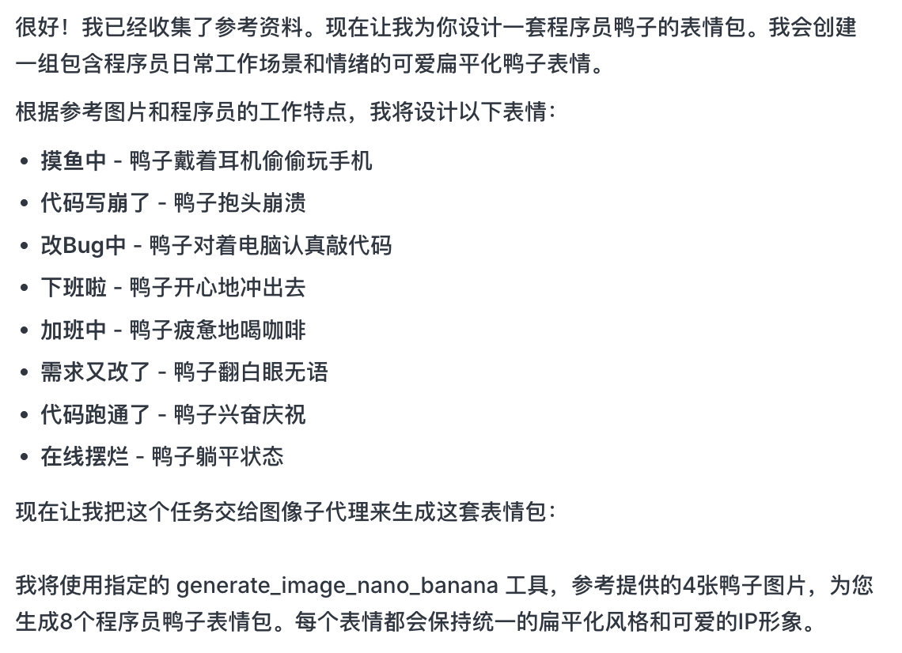

这一步，AI 从“执行者”转变为“策划者”。在AI帮你分析完需求后，可以在Lovart的画布区看到多种风格和内容的程序员鸭子图片。可以开始筛选你喜欢的风格。

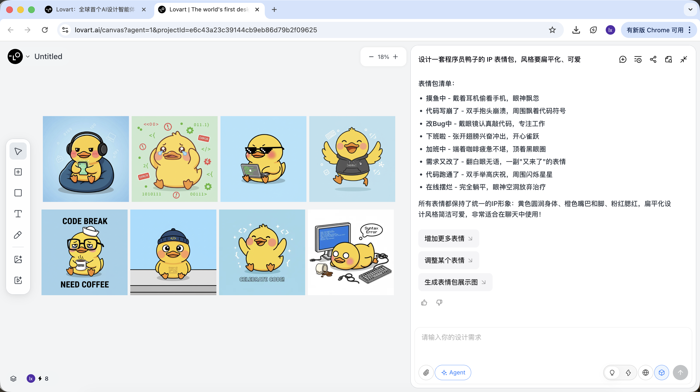

#### 环节二：一致性（基于参考的视觉锚定）

Lovart 中的图片不仅是结果，也参与后续生成。

##### 完整参考图

* 从草图中选出一张最满意的“标准鸭子”，在画布区点击对应图片
* 该图将会自动出现在对话区，作为 Reference


* 输入新的动作（如开心）并生成

生成结果会继承母版的配色、比例和细节。


##### 局部参考 / 多图整合

除了整张图片作为参考，Lovart 还支持：

* **只选取图片的局部区域** （例如只参考帽子或表情）

点击画布区左侧tab栏，选择「Mark」键，在目标图像的局部区域标记即可，这部分内容会自动同步到对话框。比如在这里我们可以选择修改背景的颜色。


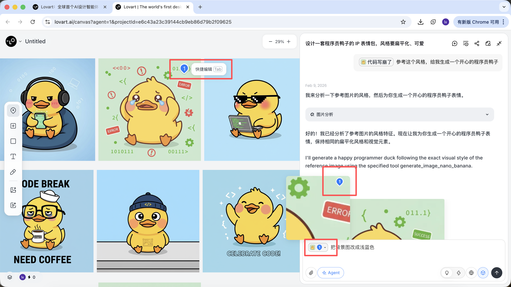

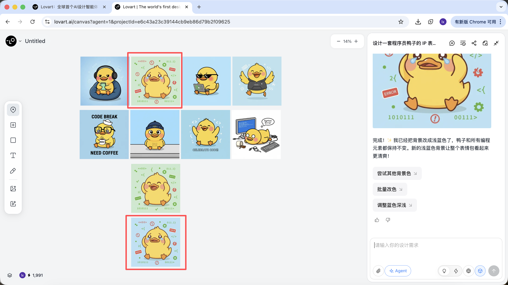

能看到新生成的图片只改变了背景的颜色，这也跟我们输入的要求一致。

* **从多张图片中分别引用子元素** ，再组合生成新结果

例如：你可以保留 A 图的角色主体，同时只替换帽子为 B 图中的样式，Agent 会在后台自动整合这些视觉约束。

以程序员鸭子为例，我们可以选择保留第一个图中的鸭子形象，并将其替换到第二张图中作为主体元素。

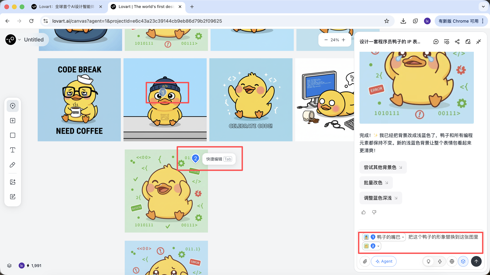


最后的效果也非常显著。你也可以试着其他的组合！

#### 环节三：落地（Agent 的工具调用）

生成完成后，可以直接执行：放大、移除背景、擦除等操作


这些并不是简单滤镜，而是 Agent 自动调度不同工具完成的结果。

而在确定完基调风格后，可以很快速的生成一系列的表情包图像。


最终我们得到的是可直接交付的生产级素材，而不仅是一张展示图。

### 2.3 使用与收费方式说明

Lovart 采用订阅制收费模式，不同套餐对应不同的使用额度与功能权限，具体以官网展示为准。

本教程不对任何套餐做推荐或比较；如果在实际使用中有需求，可以根据个人情况选择付费升级。
目前支持通过**支付宝**等方式完成支付。


#### 小结

Lovart 并不是替代底层模型，而是通过 Agent 机制，让图像生成从“单次执行”升级为“连续工作流”。

当任务开始涉及策划、一致性和交付时，这类工具的优势会变得非常明显。

## 第 3 章：自己动手做一个智能绘图助手

除了直接使用 Lovart，我们也可以自己实现一个简化版的绘图助手。

本章以“文章自动配图”为例，从实际问题出发，逐步搭建一个带有思考能力的 Agent。

### 3.1 痛点引入：为什么直接发文章给画图模型没用？

直接将一篇较长的文章输入给 NanoBanana 并要求配图，通常很难得到理想结果。原因并不在于模型“画得不行”，而在于 **它并不擅长理解长文本** 。

图像生成模型更适合处理简短、明确的视觉描述，而当输入变成一段包含结构、重点和上下文关系的文章时，模型无法判断哪些内容才是画面中真正需要表达的部分。这往往会导致生成结果偏离主题，或只能捕捉到零散细节，缺乏整体概括能力。

本质上，图像模型只有“执行”的能力，却缺少对文本进行分析和取舍的过程。


### 3.2 解决思路：用 Agent 把「理解」和「执行」拆开

要解决这个问题，关键并不是更复杂的提示词，而是 **在绘图之前先把事情想清楚** 。因此，我们在生成流程中引入一个独立的「思考层」，并以此构建一个最简单可用的 Agent。

这个 Agent 的核心目标只有一个：**让最终生成的图片，尽可能贴近用户真正的表达意图。**

整体流程可以概括为：**长文本输入 → 语言模型理解与判断 → 生成合适的视觉提示词 → 图像模型执行生成 → 输出图片**


那我们构建的 Agent 怎样才能明白用户的意图呢？

这里选择做一个简化的 **“思考层”** ，我们设置了三种不同的意图：无效输入、直接生图、需要理解的长文本。

在这个 Agent 中，各个角色的分工可以概括为四点：

1. **语言模型作为决策核心**
   它负责理解文章内容、判断用户输入的意图，并将任务分发到合适的生成路径中，决定接下来“该怎么做”以及如何生成生图提示词。
2. **图像模型作为执行者**
   图像模型不参与理解与判断，只接收已经整理好的视觉指令，专注完成图像渲染。
3. **用户作为可介入的引导者**
   除了直接输入文本，用户还可以在过程中手动调整生成的提示词，或加入参考图来辅助生成，从而对最终结果进行引导和微调。
4. **Gradio 与后端 ****API**** 作为整体承载层**
   它们负责将界面、模型调用和结果展示串联起来，保证整个 Agent 能够以一个完整 Web 应用的形式稳定运行。


### 3.3 实战准备 ：获取API

看起来是不是很有趣呢！要跑通上述流程，我们只需要准备两类 API。

#### 手：NanoBanana API（图像生成）

直接沿用第 1 章中已经配置好的 API Key 和 API URL，无需额外设置。

#### 脑：SiliconFlow API（文本思考）

我们需要一个大语言模型来承担“思考层”的职责。本教程使用 SiliconFlow 提供的模型服务：[https://cloud.siliconflow.cn](https://cloud.siliconflow.cn/)


  SiliconFlow 提供了兼容 OpenAI API 规范的接口，可以非常方便地在项目中通过标准网络请求进行调用。在这里我们选择的是免费的Qwen2.5-7B-Instruct模型，调用需要的内容都已经写入下面的Prompt。在开始之前，你只需要在官网注册账号并创建一个 API Key。


  该 Key 将用于后续的模型调用。

### 3.4 搭建Agent ：

本次实验主要使用Trae来帮我们编写代码，本教程选用的是Gemini-3-Pro-Preview模型。总思路是，新建项目后将下述完整 Prompt 复制到对话框并输入，逐步替换 API KEY 后运行代码，完成测试即可。

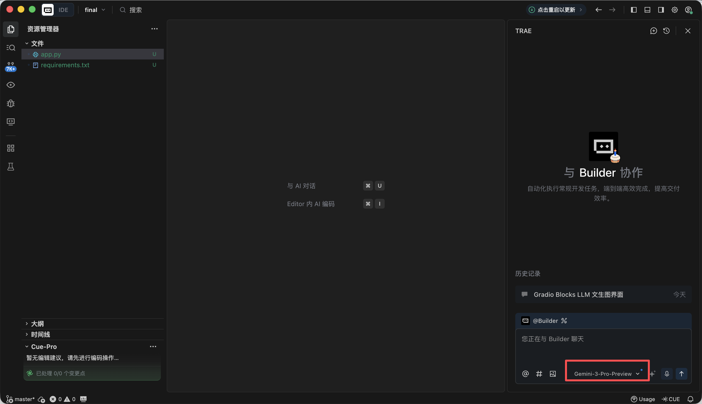

#### 环节1️⃣：Gradio Blocks 基础框架与界面布局

在这个环节，我们的主要目标是先给整个Agent搭建出一个“外观”，实现前端的页面设计。复制以下Prompt在Trae对话框中实现后，你将会得到一个本地的URL（通常是 http://127.0.0.1:7860 ）即可查看界面，并且检验实现效果。

```Plain
板块 1：Gradio Blocks 基础框架与界面布局
1、任务目标
·基于 Gradio 4.0.0+ 的 Blocks 布局，实现「LLM+Nanobanana 文生图」项目的基础界面，严格遵循固定左右分栏布局，初始化所有 UI 组件并设置正确的初始状态。

2、技术栈要求
·必须使用 Gradio 4.0.0+ 的 Blocks 模式开发，禁止使用 Interface 模式；
·依赖：gradio>=4.0.0，pillow>=10.0.0（仅导入，暂不实现图片处理逻辑）；
·代码需是完整可运行的 Python 文件，包含所有必要的导入语句。

3、界面布局规则（核心约束，融合实战细节）
·整体布局：
页面标题：LLM 驱动的文生图全流程工具；
固定左右分栏：左侧占 60% 宽度，右侧占 40% 宽度，使用 gr.Row 和 gr.Column 实现比例控制。
·左侧 60%（提示词生成流程区）组件清单：
input_text：gr.Textbox，标签「输入文本（教程段落 / 绘图指令）」，lines=6，占位符「请输入需要配图的教程文本或直接绘图指令...」；
identify_intent_btn：gr.Button，value="识别意图"，初始状态正常可点击；
intent_status：gr.Textbox，标签「意图类型 / 处理状态」，lines=2，interactive=False，初始值「未识别意图」；
system_prompt：gr.Textbox，标签「System Prompt（仅文章配图意图可编辑）」，lines=4，interactive=False，占位符「LLM 生成提示词的约束规则...」；
confirm_prompt_btn：gr.Button，value="确认生成生图提示词"，interactive=False（初始禁用防误触）；
generation_prompt：gr.Textbox，标签「生图提示词（可编辑）」，lines=3，interactive=True，初始值为空，占位符「生成的英文生图提示词将显示在此，支持手动修改...」。
·右侧 40%（Nanobanana 生图功能区）组件清单：
ref_image：gr.Image，标签「参考图（可选，图生图）」，type=filepath，height=300，允许上传；
generate_btn：gr.Button，value="生成图片"，interactive=False（初始禁用，无提示词不可点击）；
result_image：gr.Image，标签「生成结果」，type=pil，height=300，初始为空，interactive=False。

4、交互逻辑要求
·所有组件的 interactive 初始状态严格按上述配置，后续通过函数动态更新；
·按钮禁用状态需直观（置灰），避免用户误操作。

5、输出要求
·生成完整的 Python 代码，仅实现界面布局和组件初始化，不包含任何业务逻辑；
·代码注释清晰，组件命名与实战版一致（input_text/identify_intent_btn 等）；
·代码可直接运行，界面结构与描述完全一致。
```

在浏览器打开http://127.0.0.1:7860后可看到Trae已经按照我们的要求生成了以下的网页，跟我们的要求大致相当，可以进行到下一步的生成中了。


#### 环节2️⃣：LLM 意图识别模块（Siliconflow API）

在日常使用VLM画图的时候，可能有以下三种常见输入情况：

1. 无意义内容，比如“你好”、“你今天吃饭了吗”等，无法画出对应的图片。
2. 文章/长文本，字数较多，比如200字左右的一篇有结构的文章，需要先理解文章的结构与内容，再考虑如何生成能完整概括这段文字的图片。
3. 直接绘图指令，比如“帮我画一只在洗澡的狗”等，要求已经阐述的非常具体，可以直接生成图片。

跟前面一样，复制以下Prompt在Trae对话框中实现，并且补充在前面步骤中获得的API。

```Plain
板块 2：LLM 意图识别模块（Siliconflow API）
1、任务目标
在已实现的 Gradio 界面基础上，为「识别意图」按钮添加点击逻辑，调用 Siliconflow API 完成意图识别，并联动组件状态。

2、技术栈要求
基于 Gradio 4.0.0+ Blocks；
依赖：requests>=2.31.0，openai；
输出完整可运行 Python 文件，包含板块 1 界面 + 本模块逻辑。

3、核心业务规则（绝对不可偏离）
·意图分类规则（仅 3 类，严格返回数字 + 描述）
1 = 无意义内容：仅闲聊、寒暄、无关对话，没有任何绘图或配图需求（如 “你好”“今天吃了吗”）；
2 = 文章 / 长文本配图需求：用户输入一段完整文章、教程、段落、说明性文字，内容偏叙事 / 说明 / 讲解，隐含需要为这段内容生成配图的意图，不需要用户明确说 “为这段文字配图”；
3 = 直接绘图指令：用户输入简短、明确的画图命令，没有长文本背景，直接要求画某个内容（如 “画一只 Apple 风格的猫”）。
·LLM 调用约束（融合实战版模板）
接口地址：https://api.siliconflow.cn/v1/chat/completions；
模型：Qwen/Qwen2.5-7B-Instruct；
temperature=0.1；
统一定义代码：
python
运行
LLM_BASE_URL = "https://api.siliconflow.cn/v1"
LLM_API_KEY = ""  # 用户自行替换
LLM_MODEL = "Qwen/Qwen2.5-7B-Instruct"# 实战验证的意图识别模板（固化到代码中）
INTENT_PROMPT_TEMPLATE = """你需要识别用户输入文本的意图，仅返回以下 3 类结果中的一种（格式：数字 + 中文描述）：
1 = 无意义内容；2 = 文章 / 长文本配图需求；3 = 直接绘图指令。

用户输入：{user_input}

识别结果：
仅提取返回结果中的数字和描述，禁止额外内容。"""

4、组件联动规则
·结果为 1：intent_status 显示「1 = 无意义内容：无绘图需求」，system_prompt 保持禁用，confirm_prompt_btn 禁用；
·结果为 2：intent_status 显示「2 = 文章 / 长文本配图需求：为输入内容生成配图」，启用 system_prompt 并填充默认规则，激活 confirm_prompt_btn；
·结果为 3：intent_status 显示「3 = 直接绘图指令：根据指令生成图片」，system_prompt 禁用且填充默认规则，激活 confirm_prompt_btn。

5、异常处理
API 异常、解析异常均给出友好提示，不崩溃，组件恢复初始状态。

6、输出要求
生成完整可运行代码，替换 LLM_API_KEY 即可使用，逻辑清晰注释完整，意图识别模板严格使用实战版。
```

刷新之前的http://127.0.0.1:7860网址，开始测试是否能正确检测三种情况。

1. 无意义内容，可以尝试输入“你好”、“谢谢”等，发现能够正常识别。

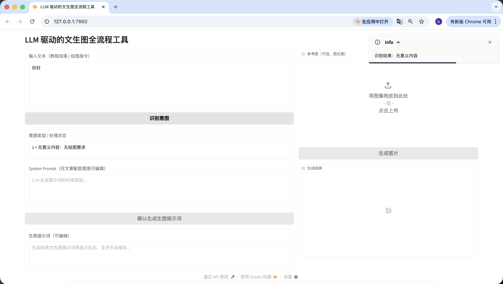

2. 文章/长文本，在这里我们选用了一段豆包生成的描述人工智能的文字。你也可以尝试使用自己的论文段落进行测试。

```Plain
人工智能正在以前所未有的深度和广度重塑教育生态系统。通过自适应学习算法，AI系统能够构建每个学生的认知图谱，实时追踪他们的知识掌握轨迹，并动态调整教学内容的难度和呈现方式。在传统课堂环境中，教师往往难以同时满足不同学习风格和能力水平的学生需求，而基于深度学习的教育平台可以分析学生在交互式模拟实验中的行为模式，识别他们在量子力学或微积分等复杂概念理解上的微妙障碍，并提供精准的认知支架。

高级自然语言处理引擎驱动的虚拟导师不仅能够解构开放性问题，如"如何评价法国大革命对现代民主制度的影响"，还能引导苏格拉底式对话，激发批判性思维。当学生撰写关于气候变化对极地生态系统影响的论文时，AI写作助手可以分析其论证逻辑的严密性，指出数据引用中的时效性问题，并建议更精准的科学术语。在特殊教育领域，计算机视觉技术使AI能够识别自闭症谱系儿童在社交互动中的非语言线索，调整干预策略，而情感计算算法则帮助检测在线学习时的挫折感，及时提供鼓励性反馈。

然而，这种技术融合引发了一系列伦理困境。算法偏见可能无意中边缘化特定文化背景的学生，数据采集的透明度问题引发了对学术隐私的关切，而过度依赖自动化评分系统可能削弱教师对学生思维过程的深层理解。更复杂的是，当AI开始生成高度逼真的虚拟实验室体验时，我们需要重新定义"实践经验"在教育中的价值。未来教育的范式可能演变为人类教师专注于培养创造力、同理心和道德判断力，而AI系统则承担知识传递、技能训练和个性化评估的职能，形成一种协同进化的教育共生体，既能发挥机器的计算优势，又能保留人类教育的独特温度.
```

同样检测成功～

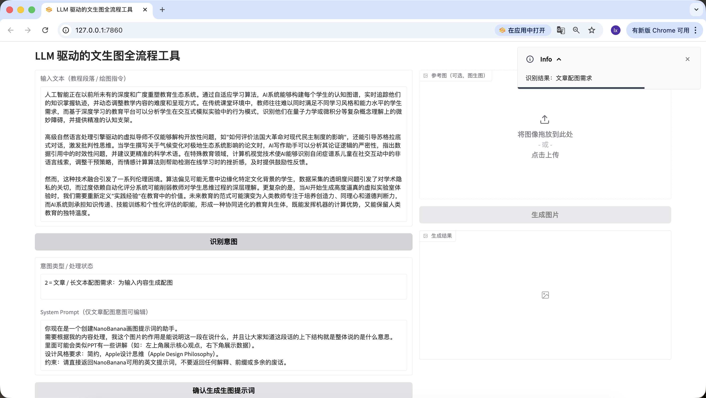

3. 直接绘图指令，这里输入的是“我要画一只猫”，同样检测准确。


到这里我们就已经顺利实现了第二个环节——意图识别。

#### 环节3️⃣：生图提示词生成模块（LLM 二次调用）

意图识别后，对于文章或长文本，还有很重要的一步就是生成画图的提示词，而这正是本Agent的重点。

```SQL
板块 3：生图提示词生成模块（LLM 二次调用）
1、任务目标
在意图识别基础上，实现「确认生成生图提示词」按钮逻辑，调用 LLM 将文本优化为适合绘图的英文视觉提示词，填充到编辑框并联动「生成图片」按钮。

2、技术栈要求
同板块 2，输出完整代码 = 板块 1 + 板块 2 + 本模块；
共用板块 2 定义的 LLM_BASE_URL、LLM_API_KEY、LLM_MODEL，不新增密钥。

3、核心业务规则（融合实战版 Prompt 组装逻辑）
·提示词生成输入规则（必须严格遵循）
生图提示词生成不再是简单字符串拼接，而是构建标准 Chat 消息列表，代码结构如下：
python
运行
messages=[# System角色：网页上用户最终确认/编辑后的system_prompt内容{"role": "system", "content": final_system_prompt},# User角色：承载待处理数据，明确任务目标{"role": "user", "content": f"请为以下内容生成视觉提示词：\n\n{user_input}"}]
意图为 2 时：System 内容取用户编辑后的 system_prompt 最终版本；
意图为 3 时：System 内容取禁用状态下填充的默认规则
user_input 为用户最初输入到 input_text 框的原始文本。
·实战验证的 System Prompt 预设（固化到代码中）
python
运行
SYSTEM_PROMPT_DEFAULT = """你现在是一个创建NanoBanana画图提示词的助手。
需要根据我的内容处理，我这个图片的作用是能说明这一段在说什么，并且让大家知道这段话的上下结构就是整体说的是什么意思。
里面可能会类似PPT有一些讲解（如：左上角展示核心观点，右下角展示数据）。
设计风格要求：简约，Apple设计思维（Apple Design Philosophy）。
约束：请直接返回NanoBanana可用的英文提示词，不要返回任何解释、前缀或多余的废话。"""
·LLM 调用约束
与板块 2 共用同一套 LLM_BASE_URL、LLM_API_KEY、LLM_MODEL；
temperature=0.7（保证提示词的创意性与适配性）；
max_tokens=200（限制输出长度，匹配提示词约束）；
严格使用上述标准 Chat 消息列表结构，禁止字符串拼接。
·示例输入输出（核心参考）
输入示例 1（文章配图意图）：原始文本：「AI 如何改变教育：随着人工智能技术的发展，教师的角色从知识传授者转变为引导者，AI 助手可辅助学生完成个性化学习，课堂上人机协作成为常态。」最终 System Prompt：SYSTEM_PROMPT_DEFAULT（未修改）输出预期："Minimalist illustration, Apple Design Philosophy, 1024x1024. Top left shows 'AI + Education' core concept, bottom right shows data of teacher-student-AI collaboration, soft color palette, clean lines, no redundant elements."
输入示例 2（直接绘图指令）：原始文本：「画一只 Apple 风格的猫，坐在 MacBook 旁边」最终 System Prompt：SYSTEM_PROMPT_DEFAULT（禁用状态）输出预期："Minimalist cat, Apple style, 1024x1024, sitting next to a silver MacBook, clean white background, soft shadows, geometric shapes, no extra details."
·提示词输出强制约束
纯英文，无中文；
必须包含 Apple Design Philosophy/Apple style + 1024x1024；
长度 50–200 字符，代码内校验；
无额外解释、前缀或废话，仅返回提示词本身。

4、组件联动规则
生成成功：将提示词填入 generation_prompt 框，激活 generate_btn，intent_status 追加「提示词生成成功，可修改后生成图片」；
生成失败：提示具体原因（如 API 调用失败、长度不达标），generate_btn 保持禁用，generation_prompt 框为空；
用户手动修改 / 清空 generation_prompt 框：
清空时自动禁用 generate_btn；
非空时保持 generate_btn 激活。

5、异常处理
API 调用失败：友好提示「提示词生成失败：{具体错误信息}」，不崩溃；
提示词校验失败：明确提示原因（如 “未包含 Apple style”“长度仅 40 字符”），允许重试；
响应解析失败：提示「无法解析 LLM 返回结果，请重试」。

6、输出要求
完整可运行代码，替换 LLM_API_KEY 即可使用；
代码结构清晰、注释完善，界面美观简洁；
严格实现标准 Chat 消息列表结构，参数与示例逻辑一致；
包含提示词长度、内容校验逻辑，错误提示友好。
```

同样复制第二个环节的文本进行检测。

值得注意的是，我们在这里预设的生成生图提示词的System Prompt为：

> 你现在是一个创建NanoBanana画图提示词的助手。
> 需要根据我的内容处理，我这个图片的作用是能说明这一段在说什么，并且让大家知道这段话的上下结构就是整体说的是什么意思。
> 里面可能会类似PPT有一些讲解（如：左上角展示核心观点，右下角展示数据）。
> 设计风格要求：简约，Apple设计思维（Apple Design Philosophy）。
> 约束：请直接返回NanoBanana可用的英文提示词，不要返回任何解释、前缀或多余的废话。

如果你想换成其他的预设模版，可以在前面的prompt里修改，或者直接在Trae里通过对话修改。


除了修改底层代码，我们在网页上也可以快速编辑。举个例子，我在这里加了一句，“在前面加一句Pic Prompt”，可以看到生成的新的提示词前面也包含了～这样设计是为了方便快速修改生成提示词的System Prompt，帮助我们快速切换风格。


#### 环节4️⃣：Nanobanana 文生图 / 图生图模块

终于来到了最后一步，不接入生图模型，就不是一个完整的Agent！

```Bash
板块 4：Nanobanana 文生图 / 图生图模块（最终版）
1、任务目标
实现「生成图片」按钮逻辑，调用真实 Nanobanana API，支持文生图 / 图生图，解析 Base64 并展示图片。

2、技术栈要求
基于 Gradio 4.0.0+ Blocks；
依赖：requests, pillow, base64, io, re；
完整代码 = 板块 1+2+3 + 本模块。

3、核心 API 配置（实战验证固化）
固化代码配置：
python
运行
# 固化到代码中的API配置
NANOBANANA_API_URL = "https://api.zyai.online/v1/chat/completions"
NANOBANANA_MODEL = "gemini-2.5-flash-image"
NANOBANANA_API_KEY = ""  # 用户自行替换
鉴权方式：Header Authorization: Bearer {NANOBANANA_API_KEY}。

4、图片预处理要求（必须实现）实现函数 image_to_base64_data_uri (ref_image_path)，核心逻辑：
将 PIL 图片转为 PNG 格式；
自动缩放到 1024x1024 分辨率；
透明通道转为白色背景；
编码为 Base64，返回格式：data:image/png;base64,...。

5、请求构建规则（严格按实战版分支逻辑）
·核心函数定义实现函数 generate_image (prompt, ref_image_path)：
入参：prompt（generation_prompt 框内容）、ref_image_path（ref_image 上传的文件路径）；
返回：PIL Image（展示到 result_image）或错误提示。
·逻辑分支 1：纯文生图（ref_image_path 为空）
python
运行
messages = [{"role": "user", "content": prompt}]
·逻辑分支 2：图生图（ref_image_path 有值）
python
运行
# 先调用图片预处理函数
image_base64 = image_to_base64_data_uri(ref_image_path)
messages = [{"role": "user","content": [{"type": "text", "text": prompt},{"type": "image_url", "image_url": {"url": image_base64}}]}]

6、响应解析要求（必须兼容两种格式）从 choices [0].message.content 中提取图片 Base64，支持：
结构化 JSON 返回的 image_url 字段；
Markdown 格式 
；
统一提取 Base64 编码，解码后转换为 PIL Image 返回。

7、组件联动与异常处理
生成成功：将 PIL Image 展示到 result_image，intent_status 提示「图片生成成功」；
生成 / 解析 / 上传失败：在 intent_status 显示清晰文字提示（如 “Base64 解析失败”“API 调用超时”），不崩溃。

8、输出要求
完整可运行代码，替换 LLM_API_KEY 和 NANOBANANA_API_KEY 即可直接运行，全流程可用，分支逻辑严格匹配实战版。
```

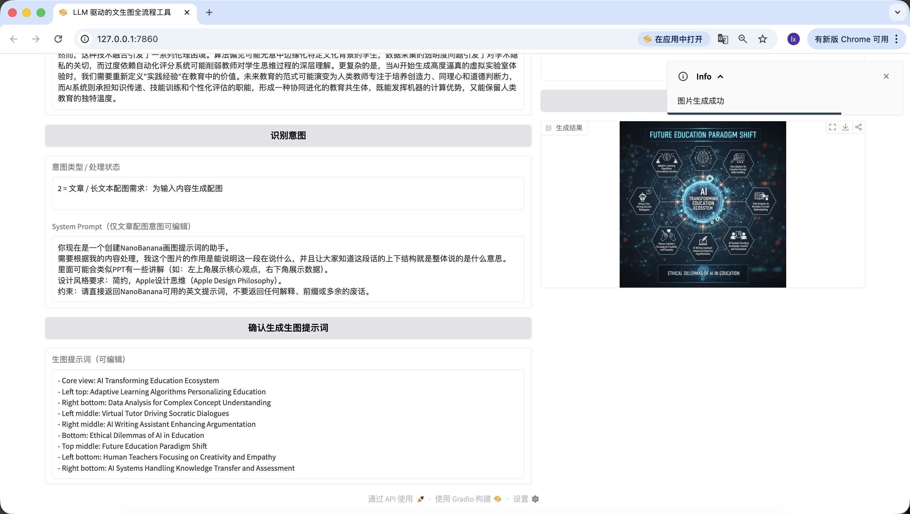

太令人激动啦！我们终于顺利地生成出了这个Agent的第一张图，仔细看看生成的图片，跟我们的文本和提示词是匹配的。到这里你已经基本上实现你自己的Agent啦！


我们还添加了图生图功能，上传你喜欢的图片，AI会自动借鉴风格。


值得一提的是，前面步骤生成的提示词也是可以在网页上编辑的，并且我们是以最终点击按钮时的提示词为准～哪怕我在这里换成“a cute cat”，最终生成的图片也只会是可爱的小猫。

## 第 4 章：总结


**呜呼！终于写完了。**
说实话，连我自己写完最后一行的时候都忍不住长舒一口气，更别说一路跟着做到这里的你了。能把这一整套流程完整跑下来，本身就已经很厉害了，这说明你真的把手放到键盘上，把事情一步步做完了。Bravo 🎉 🥳 👏

在写这套内容的过程中，我一直在想，我们到底要留下些什么？答案其实并不是模型名字、参数或者某种固定套路，而是让你慢慢建立起一种感觉：哪些事情可以放心交给 AI 去理解和规划，哪些地方只需要你来决定方向。一旦这层分工成立，很多原本看起来复杂的生成流程，都会开始变得顺起来。

回头看，这条路其实并不复杂。想清楚你要解决的问题，把长文本交给语言模型去拆解，再把整理好的视觉意图交给绘图模型去呈现，最后把这一整套流程封装成一个属于你自己的小助手。到这里，你已经不只是“在用模型”，而是在搭建一套可以长期陪你工作的系统，而这，才是这套教程最想带给你的东西。

但是你已经做的很棒啦！相信学到这里的你对Vibe Coding已经有初步的掌握了，给自己放个小假休息一下吧！
