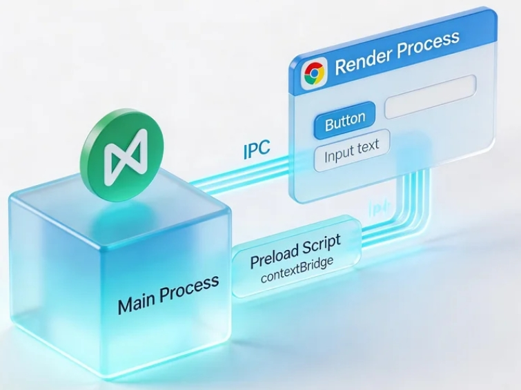
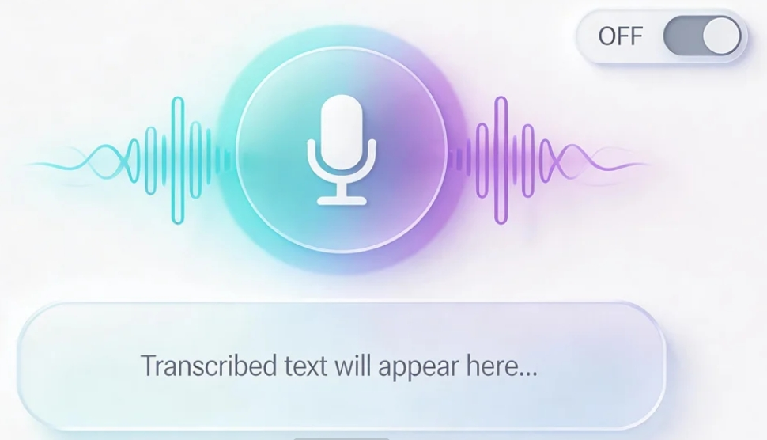
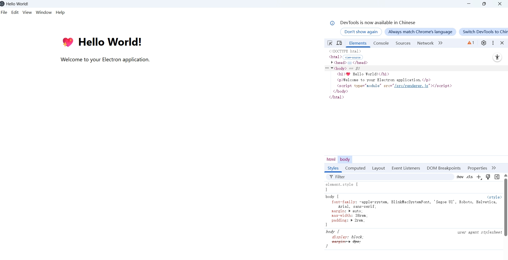
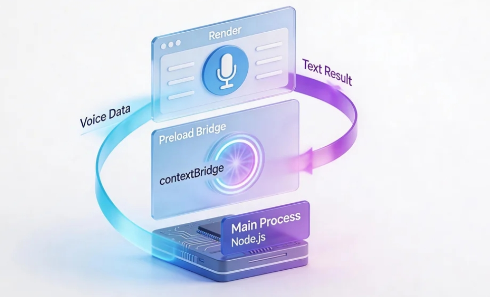
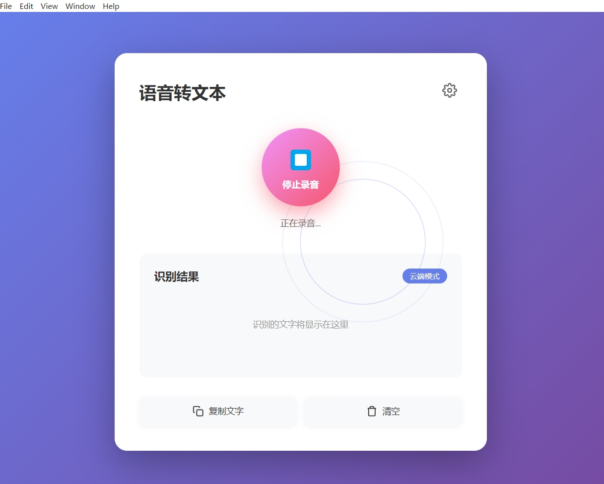
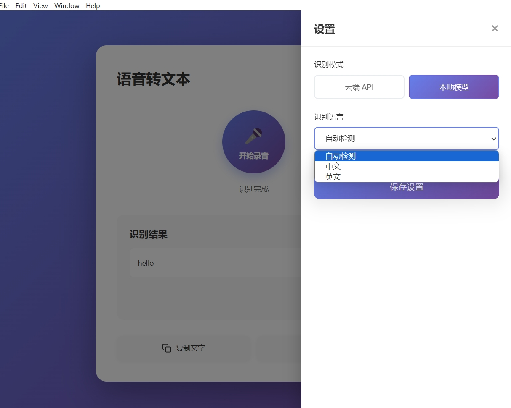
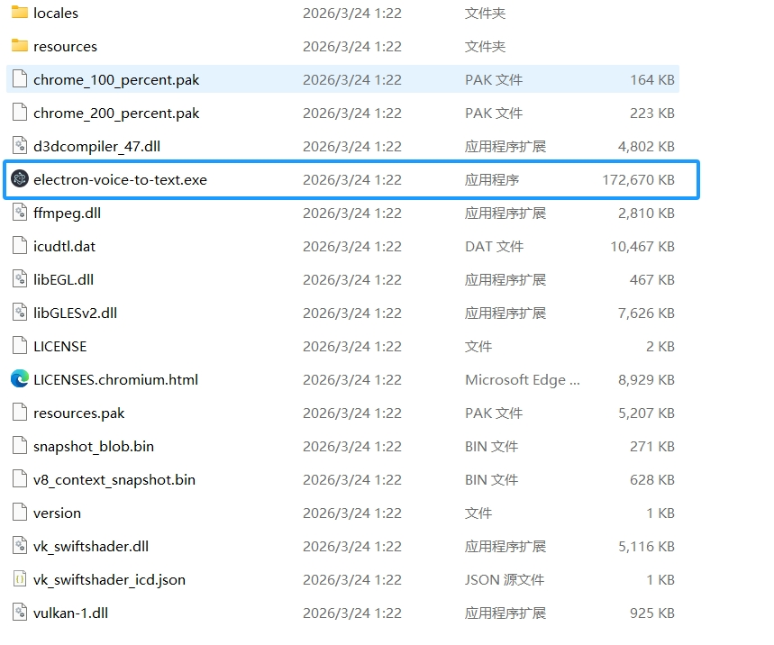

# 如何开发跨平台 Electron 桌面程序——语音转文字应用

# 第 1 章：什么是 Electron 和桌面应用开发

在这篇教程中，我们将完整跑通一条闭环：从零开始用 Electron 构建一个语音转文字的桌面应用，支持云端 API 和本地模型两种识别方式，最终打包成可以在 Windows、macOS、Linux 上安装运行的真实桌面程序。

本次教程，你至少需要具备：

- 一台电脑（Windows 或 Mac，推荐 Mac，因为 Apple Silicon 跑本地模型非常快）
- Node.js 环境（18.0 以上版本）
- 你的 AI 编程助手（Cursor / Trae / Claude Code）
- （可选）OpenAI API Key（如果使用云端模式）
- 一个麦克风（笔记本自带的就行）

## 1.1 什么是 Electron？

你每天都在用的 **VS Code、Slack、Discord、Notion**，它们有一个共同点：都是用 **Electron** 构建的桌面应用。

Electron 是一个开源框架，它让你可以用 **HTML + CSS + JavaScript**（也就是做网页的那套技术）来构建 **Windows、macOS、Linux** 三个平台通用的桌面程序。它的原理很简单——把 Chromium 浏览器和 Node.js 打包在一起，你的网页就变成了一个独立的桌面 App。

**一句话理解**：Electron = 一个"隐形的 Chrome 浏览器" + Node.js 的系统能力。


<!--  -->

## 1.2 Electron 的核心架构

Electron 应用由两种进程组成，理解它们是开发的关键：

**主进程（Main Process）**

* 相当于 App 的"总管"
* 负责创建窗口、管理应用生命周期、访问文件系统等原生能力
* 运行在 Node.js 环境中，可以使用所有 Node.js 模块
* 整个应用只有一个主进程

**渲染进程（Renderer Process）**

* 相当于 App 的"门面"
* 就是一个 Chromium 网页，负责展示 UI
* 每个窗口对应一个渲染进程
* 出于安全考虑，渲染进程不能直接访问 Node.js API

**预加载脚本（Preload Script）**

* 主进程和渲染进程之间的"桥梁"
* 通过 `contextBridge` 安全地暴露特定的 API 给渲染进程

它们之间通过 **IPC（进程间通信）** 来传递消息，就像打电话一样：渲染进程说"我要录音"，主进程收到后去调用系统麦克风。


<!--  -->

## 1.3 我们要做什么？

在这篇教程中，我们将构建一个 **语音转文字（Speech-to-Text）** 桌面应用。它的功能很直观：

1. 点击"开始录音"按钮，App 开始监听麦克风
2. 说完话后点击"停止"，App 将语音发送给 AI 进行识别
3. 识别结果以文字形式展示在界面上，可以一键复制

**两种识别模式可选：**

| 对比维度 | 云端 API 模式 | 本地模型模式 |
|---------|-------------|------------|
| 代表方案 | OpenAI Whisper API | whisper.cpp |
| 是否需要联网 | 是 | 否 |
| 识别速度 | 取决于网络 | 取决于硬件（Apple Silicon 上极快） |
| 中文识别质量 | 优秀 | 优秀（large-v3 模型） |
| 使用成本 | $0.006/分钟 | 免费 |
| 模型体积 | 无需下载 | tiny 模型 75MB，large 模型 3GB |
| 适合场景 | 快速上手、轻量使用 | 注重隐私、离线使用、长期高频使用 |


<!--  -->

## 1.4 重要提醒：Web Speech API 在 Electron 中不可用

如果你搜索过"Electron 语音识别"，可能会看到有人推荐使用浏览器自带的 `Web Speech API`。**请注意：这个方案在 Electron 中行不通。**

Google 已经关闭了对非 Chrome/Edge 浏览器壳的语音 API 支持。Electron 虽然基于 Chromium，但它不是 Chrome 本身，所以 `window.SpeechRecognition` 会直接报错。

这就是为什么我们需要使用 OpenAI Whisper API 或 whisper.cpp 这样的独立方案。

## 1.5 本教程的路线图

我们将按以下步骤完成整个流程：

1. **创建 Electron 项目**：用 Electron Forge 搭建项目骨架，理解进程间通信
2. **实现录音功能**：在渲染进程中捕获麦克风，处理音频数据
3. **云端识别（方案 A）**：调用 OpenAI Whisper API 进行语音转文字
4. **本地识别（方案 B）**：使用 whisper.cpp 在本地运行模型，无需联网
5. **打包与分发**：将应用打包成可安装的桌面程序

# 第 2 章：创建 Electron 项目

## 2.1 用 AI 初始化项目

打开你的 AI 编程助手，在对话框中输入以下 Prompt：

```
帮我用 Electron Forge 创建一个新的 Electron 项目，项目名称叫 voice-to-text，使用 Vite 模板。命令参考：npx create-electron-app voice-to-text --template=vite创建完后进入项目目录，安装依赖并帮我把基础环境搭好。
```


Electron Forge 是 Electron 官方推荐的脚手架工具，它帮你处理了项目初始化、打包、分发等繁琐的事情。

创建完成后，项目结构大致如下：

```
voice-to-text/
├── src/
│   ├── main.js            # 主进程入口
│   ├── preload.js         # 预加载脚本（桥梁）
│   ├── renderer.js        # 渲染进程入口
│   └── index.html         # 应用的 HTML 页面
├── forge.config.js        # Electron Forge 配置
├── vite.main.config.mjs   # 主进程 Vite 配置
├── vite.preload.config.mjs # 预加载脚本 Vite 配置
├── vite.renderer.config.mjs # 渲染进程 Vite 配置
└── package.json
```

## 2.2 启动并预览

让 AI 帮你启动开发服务器：

```
帮我把 voice-to-text 项目的 Electron 开发服务器启动，用 npm start 启动
```

几秒钟后，一个桌面窗口会弹出来——这就是你的 Electron 应用！虽然现在只有一个默认的欢迎页面，但它已经是一个真正的桌面程序了。


<!--  -->

## 2.3 理解进程间通信（IPC）

在开始写语音功能之前，我们需要理解 Electron 最核心的概念——**IPC（Inter-Process Communication，进程间通信）**。

因为渲染进程（UI 界面）和主进程（系统能力）是隔离的，它们之间需要通过 IPC "打电话"来协作：

```
渲染进程（UI）                    主进程（系统）
    │                                │
    │── "我要开始录音" ──────────→    │
    │                                │── 调用麦克风
    │                                │── 处理音频
    │    ←──── "这是识别结果" ────────│
    │                                │
    │── 显示文字到界面                │
```

在代码中，这个通信通过 `preload.js` 来桥接：

```javascript
// preload.js - 安全地暴露 API 给渲染进程
const { contextBridge, ipcRenderer } = require('electron')

contextBridge.exposeInMainWorld('electronAPI', {
  // 渲染进程 → 主进程
  sendAudio: (audioData) => ipcRenderer.invoke('transcribe-audio', audioData),
  // 主进程 → 渲染进程
  onResult: (callback) => ipcRenderer.on('transcription-result', callback)
})
```

```javascript
// main.js - 主进程监听消息
const { ipcMain } = require('electron')

ipcMain.handle('transcribe-audio', async (event, audioData) => {
  // 在这里调用 Whisper API 或 whisper.cpp
  const text = await transcribe(audioData)
  return text
})
```


<!--  -->

# 第 3 章：实现录音功能

## 3.1 在渲染进程中捕获麦克风

浏览器（也就是 Electron 的渲染进程）提供了 `navigator.mediaDevices.getUserMedia` API 来访问麦克风。让 AI 帮你实现录音功能：

```
麻烦帮我修改一下项目里的 src/index.html 和 src/renderer.js 这两个文件，帮我实现完整的语音录制 + 语音识别功能，具体要求我整理好了：
界面设计：
1. 做一个大尺寸的圆形按钮，默认显示“开始录音”；点击后按钮变成红色，文字切换成“停止录音”
2. 录音过程中，按钮要带一个简单的脉冲动画，让用户能直观看到正在录音
3. 按钮下方放一块文字展示区，用来显示语音识别出来的文本内容
4. 页面底部配置 “复制文字” 和 “清空” 两个功能按钮，分别实现识别结果复制、结果区域清空的功能
5. 页面右上角增加设置图标，点击可切换识别模式（云端识别 / 本地识别）
录音逻辑要求（需要在 renderer.js 中实现）
1. 点击录音按钮后，调用 navigator.mediaDevices.getUserMedia 获取麦克风权限
2. 用 MediaRecorder 实现音频录制，录制格式固定为 webm
3. 停止录音后，把录制好的音频 Blob 对象转成 ArrayBuffer 格式
4. 调用 window.electronAPI.sendAudio 方法，把音频数据发送给主进程
5. 还需要监听主进程返回的识别结果，并将结果展示在文字显示区域中
```

核心录音代码：

```javascript
// renderer.js
let mediaRecorder = null
let audioChunks = []

async function startRecording() {
  const stream = await navigator.mediaDevices.getUserMedia({
    audio: {
      channelCount: 1,
      sampleRate: 16000,
      echoCancellation: true,
      noiseSuppression: true
    }
  })

  mediaRecorder = new MediaRecorder(stream, {
    mimeType: 'audio/webm;codecs=opus'
  })

  audioChunks = []
  mediaRecorder.ondataavailable = (e) => audioChunks.push(e.data)

  mediaRecorder.onstop = async () => {
    const audioBlob = new Blob(audioChunks, { type: 'audio/webm' })
    const arrayBuffer = await audioBlob.arrayBuffer()

    // 发送给主进程进行识别
    const result = await window.electronAPI.sendAudio(arrayBuffer)
    document.getElementById('result').textContent = result
  }

  mediaRecorder.start()
}
```

<!--  -->

## 3.2 处理麦克风权限

Electron 默认会拦截权限请求。我们需要在主进程中明确允许麦克风访问：

```
请帮我在 main.js 中添加麦克风权限处理：
1. 用 session.defaultSession.setPermissionRequestHandler 来处理权限请求
2. 当请求类型是 media 麦克风权限时，直接自动允许
3. 如果是 macOS 系统，记得在 package.json 或者 entitlements 里加上麦克风使用说明，保证权限能正常生效
```

```javascript
// main.js 中添加
const { session } = require('electron')

session.defaultSession.setPermissionRequestHandler(
  (webContents, permission, callback) => {
    if (permission === 'media') {
      callback(true)
    } else {
      callback(false)
    }
  }
)
```

> **macOS 用户注意**：macOS 会弹出系统级的麦克风权限请求对话框，这是正常的，点击"允许"即可。

# 第 4 章：方案 A——云端识别（OpenAI Whisper API）

这是最简单的方案，只需要一个 API Key 和几行代码。

## 4.1 获取 OpenAI API Key

1. 访问 [OpenAI Platform](https://platform.openai.com/)，注册并登录
2. 进入 API Keys 页面，点击 **"Create new secret key"**
3. 复制生成的 Key（以 `sk-` 开头），妥善保存

> **费用参考**：Whisper API 的价格是 **$0.006/分钟**，也就是说识别 1 小时的语音只需要 $0.36（约 2.5 元人民币），非常便宜。

## 4.2 在主进程中调用 Whisper API

让 AI 帮你在主进程中实现语音识别：

```
请帮我在 main.js 中实现 OpenAI Whisper API 的调用：
1. 安装 node-fetch（如果项目需要），或者直接用 Node.js 自带的 fetch
2. 写一个 transcribeWithWhisper 函数，参数传入音频的 ArrayBuffer
3. 把传入的 ArrayBuffer 转换成 Blob 或 File，然后组装成 FormData 格式
4. 调用 https://api.openai.com/v1/audio/transcriptions
5. 模型指定用 whisper-1，语言设置为中文 zh
6. 接口调用完成后，返回识别出来的文本内容
7. API Key 从环境变量或配置文件读取
```

核心代码：

```javascript
// main.js
async function transcribeWithWhisper(audioBuffer, apiKey) {
  const blob = new Blob([audioBuffer], { type: 'audio/webm' })
  const formData = new FormData()
  formData.append('file', blob, 'audio.webm')
  formData.append('model', 'whisper-1')
  formData.append('language', 'zh')

  const response = await fetch(
    'https://api.openai.com/v1/audio/transcriptions',
    {
      method: 'POST',
      headers: { Authorization: `Bearer ${apiKey}` },
      body: formData
    }
  )

  const data = await response.json()
  return data.text
}
```

<!--  -->

## 4.3 添加设置界面

让 AI 帮你在渲染进程中添加一个简单的设置面板，用于输入 API Key 和切换识别模式：

```
请帮我在 index.html 中添加一个设置面板：
1. 页面右上角加一个齿轮样式的设置图标，点击后弹出设置面板
2. 面板里要包含这几项：识别模式切换（云端 API / 本地模型）、API Key 输入框（只有云端模式下才显示）、语言选择下拉菜单（中文、英文、自动检测可选）
3. 所有设置内容自动保存到 localStorage
4. 点击面板外面的区域就能关闭面板
```

<!--  -->

# 第 5 章：方案 B——本地识别（whisper.cpp）

如果你不想依赖云端 API，或者需要离线使用，whisper.cpp 是最佳选择。它是 OpenAI Whisper 模型的 C++ 移植版本，可以完全在本地运行，不需要联网。

## 5.1 安装 whisper.cpp 的 Node.js 绑定

让 AI 帮你安装和配置：

```
请帮我在项目中安装 nodejs-whisper 包：
npm install nodejs-whisper

安装完成后，请帮我下载 whisper 的 tiny 模型（用于测试，体积小速度快）。
nodejs-whisper 本身会自动完成模型下载，不用额外处理。
```

> **模型选择指南**：
> * `tiny`（75MB）：速度最快，适合测试和轻量使用，准确率一般
> * `base`（142MB）：速度和准确率的平衡点
> * `small`（466MB）：中文识别质量明显提升
> * `large-v3-turbo`（1.5GB）：推荐！速度是 large 的 5-8 倍，准确率仅差 1-2%
> * `large-v3`（3GB）：最高准确率，但速度较慢，需要较好的硬件

## 5.2 在主进程中集成 whisper.cpp

让 AI 帮你实现本地识别功能：

```
请帮我在main.js里添加 whisper.cpp 本地语音识别功能：
先引入 nodejs-whisper 包，然后写一个 transcribeWithLocal 函数。函数接收音频 ArrayBuffer，先把它保存成临时的 WAV 文件（要求 16kHz、单声道），再调用 nodejs-whisper 做识别，识别完成后返回文字结果，最后把临时文件删掉就行
```

核心代码：

```javascript
// main.js
const { nodewhisper } = require('nodejs-whisper')
const path = require('path')
const fs = require('fs')
const os = require('os')

async function transcribeWithLocal(audioBuffer) {
  // 保存为临时文件
  const tempPath = path.join(os.tmpdir(), `recording-${Date.now()}.wav`)
  fs.writeFileSync(tempPath, Buffer.from(audioBuffer))

  try {
    const result = await nodewhisper(tempPath, {
      modelName: 'base',
      autoDownloadModelName: 'base',
      whisperOptions: {
        language: 'zh',
        word_timestamps: true
      }
    })
    return result.map(r => r.speech).join('')
  } finally {
    // 清理临时文件
    fs.unlinkSync(tempPath)
  }
}
```

<!--  -->

## 5.3 Apple Silicon 用户的福音

如果你使用的是 M1/M2/M3/M4 芯片的 Mac，whisper.cpp 会自动利用 **Metal GPU 加速** 和 **Apple Neural Engine**，识别速度可以达到 **比实时更快**——也就是说，1 分钟的语音可能只需要几秒钟就能识别完。

对于 NVIDIA 显卡用户，whisper.cpp 也支持 **CUDA 加速**，同样能获得很好的性能。

# 第 6 章：打包与分发

开发完成后，我们需要把应用打包成可以分发的安装包。

## 6.1 使用 Electron Forge 打包

Electron Forge 已经内置在我们的项目中，打包非常简单：

```
麻烦帮我运行一下 Electron Forge 的打包命令，执行以下指令就行：
npx electron-forge make
```

这个命令会根据你当前的操作系统自动生成对应的安装包：

* **macOS**：生成 `.dmg` 安装镜像和 `.zip` 压缩包
* **Windows**：生成 `.exe` 安装程序（Squirrel 格式）
* **Linux**：生成 `.deb`（Debian/Ubuntu）和 `.rpm`（Fedora）包

打包产物在 `out/make/` 目录下。

<!--  -->

## 6.2 应用体积优化

Electron 应用的一个"痛点"是体积较大（因为打包了整个 Chromium）。一些优化建议：

* 确保只有 `dependencies` 中的包会被打包，开发依赖放在 `devDependencies`
* 使用 Vite 的 tree-shaking 减少 JS 体积
* 如果使用本地模型，考虑让用户首次启动时下载，而不是打包在安装包里

| 配置 | 预估体积 |
|------|---------|
| 纯 Electron 应用（无模型） | ~150-200 MB |
| + whisper tiny 模型 | ~250 MB |
| + whisper large-v3-turbo 模型 | ~1.7 GB |

## 6.3 跨平台注意事项

**macOS：**
* 发布到 App Store 或分发给其他用户需要 **代码签名**（Apple Developer ID，$99/年）
* 还需要经过 Apple 的 **公证（Notarization）** 流程
* 麦克风权限需要在 `Info.plist` 中声明 `NSMicrophoneUsageDescription`
* 建议构建 Universal Binary 以同时支持 Intel 和 Apple Silicon

**Windows：**
* 建议进行代码签名，否则 Windows SmartScreen 会弹出安全警告
* 用户仍然可以选择"仍要运行"来使用未签名的应用

**Linux：**
* 不需要代码签名
* 推荐同时提供 `.deb` 和 `.AppImage` 格式

> **提示**：对于个人项目或小范围分发，可以暂时跳过代码签名，直接把打包好的文件发给朋友使用。

# 第 7 章：写在最后

恭喜你！你已经从零构建了一个跨平台的语音转文字桌面应用。回顾一下我们做了什么：

1. 用 Electron Forge 搭建了跨平台桌面应用骨架
2. 理解了主进程、渲染进程和 IPC 通信机制
3. 实现了麦克风录音和音频捕获
4. 集成了两种语音识别方案：云端 Whisper API 和本地 whisper.cpp
5. 学会了打包和分发 Electron 应用

Electron 的强大之处在于——你用做网页的技术栈，就能构建出 VS Code、Slack 这样级别的桌面应用。而 AI 语音识别技术的成熟，让"语音转文字"这个曾经需要专业团队才能做的功能，现在一个人就能搞定。

**进阶方向：**

* **实时字幕**：使用 AudioWorklet 实现流式音频传输，配合支持流式识别的 API，实现边说边出字
* **会议记录助手**：录制整场会议，自动生成带时间戳的文字记录，再用 AI 总结要点
* **多语言翻译**：识别语音后，调用翻译 API 实时翻译成其他语言
* **语音笔记本**：结合本地数据库（如 SQLite），构建一个可搜索的语音笔记应用

***用你的声音，让代码替你记录一切。***

# 参考文献

* [Electron 官方文档](https://www.electronjs.org/docs/latest/)
* [Electron Forge 官方文档](https://www.electronforge.io/)
* [OpenAI Whisper API 文档](https://platform.openai.com/docs/guides/speech-to-text)
* [whisper.cpp GitHub 仓库](https://github.com/ggml-org/whisper.cpp)
* [nodejs-whisper npm 包](https://www.npmjs.com/package/nodejs-whisper)
* [MDN MediaDevices.getUserMedia()](https://developer.mozilla.org/en-US/docs/Web/API/MediaDevices/getUserMedia)

