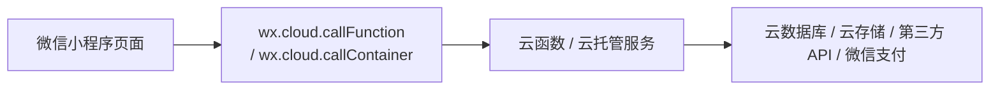

# 如何构建一个带后端的微信小程序

在上一节里，我们做的是一个“前端就能跑起来”的小程序。但只要你的产品开始接近真实业务，很快就会遇到这样几类需求：

- 用户登录后，需要识别“这是谁”
- 数据不能只存在本地，而要能跨设备同步
- 图片、音频、文档需要上传到云端
- 订单、支付、会员、积分这些逻辑不能放在前端裸奔
- 你希望接入 AI、数据库、管理后台、定时任务、消息通知

这时候，你做的就不再只是一个“小程序页面”，而是一个完整的小程序产品。它需要前端，也需要后端。

截至 **2026 年 3 月 25 日**，如果你的目标是“尽快做出真实可上线的小程序，并且尽量少踩基础设施的坑”，最推荐的路线不是一上来就自己买服务器、配 Nginx、写一堆鉴权中间件，而是：

::: tip 推荐路线
**优先选择：微信小程序 + 微信云开发 / CloudBase**

也就是用：

- 小程序前端负责界面和交互
- 云函数或云托管负责后端逻辑
- 云数据库负责数据存储
- 云存储负责文件
- 安全规则、内容审核、日志等能力作为上线标配
:::

原因很简单：这条路线和微信生态贴得最近，登录态传递、用户身份识别、文件上传、数据库访问、服务端函数调用都更顺手，特别适合新手、独立开发者、MVP、内容产品、工具类产品，以及你现在这种 **“用 AI 快速把产品做出来”** 的场景。

当然，这并不意味着“自建后端”没价值。真正的最佳实践，不是所有项目都用同一种方案，而是 **先选最省心的默认方案，再在必要时升级到更重的架构** 。

# 1. 什么叫“小程序带后端”

最简单的理解是：

- **前端**：跑在微信里的界面，负责展示页面、接收点击、发起请求
- **后端**：跑在服务器或云端，负责身份校验、数据库读写、支付签名、业务规则、第三方 API 调用

一个成熟的小程序，通常会把职责分成三层：

1. **小程序前端层**

负责页面 UI、表单输入、列表展示、加载状态、错误提示、用户操作。

2. **业务逻辑层**

负责“真正重要”的事情，例如：创建订单、检查权限、扣减库存、生成支付参数、调用大模型、审核内容、写操作日志。

3. **数据与资源层**

负责存储用户数据、文章内容、订单信息、上传文件、图片资源、审核结果等。

这三层不要混在一起。尤其是第二层，绝对不能为了省事直接塞到前端里。

## 1.1 哪些事情必须放到后端

下面这些能力，原则上都应该放在服务端，而不是直接写在小程序前端：

- `AppSecret`、支付密钥、商户私钥、第三方平台密钥
- 登录态换取、用户身份绑定、管理员权限判断
- 支付下单、签名生成、支付回调验签
- 数据库的写权限控制
- 价格、库存、积分、优惠券等业务规则
- 内容审核、风控、限流、反刷
- 定时任务、批处理、异步任务

只要一条逻辑涉及“密钥、权限、金额、不可篡改的业务规则”，就不要把它放在前端。

# 2. 最推荐的架构是什么

对大部分第一次做“小程序 + 后端”的项目，我推荐你用下面这个架构：



这条路线背后的核心思路是：

- **前端尽量薄**
  只做 UI、参数收集、结果展示，不直接碰密钥和关键业务规则。
- **后端尽量集中**
  让鉴权、支付、数据写入、权限控制都从服务端入口走。
- **数据权限默认收紧**
  先默认拒绝，再按角色和场景放开。
- **先用托管能力跑通闭环**
  先把产品做出来，再考虑是否拆分成更复杂的微服务。

## 2.1 三种可选路线

### 路线 A：云开发（默认推荐）

最适合：

- 新手第一次做带后端的小程序
- 工具类、内容类、社区类、表单类、轻电商类产品
- 想快速做 MVP、验证需求、快速上线
- 希望和微信登录态、云函数、云数据库配合得更顺

典型能力组合：

- `wx.cloud.callFunction`
- 云函数
- 云数据库
- 云存储
- 内容安全审核
- 定时任务

这是我最推荐你先学、先用、先跑通的一条线。

### 路线 B：云托管 / HTTP 服务（推荐给中等复杂度项目）

最适合：

- 你已经有现成的 Node.js / NestJS / Express / Python / Go 服务
- 需要标准 HTTP API、复杂路由、更多中间件
- 需要更灵活的容器化部署
- 需要对接更多第三方服务，或者你未来还想服务 H5、管理后台、App

这条路线依然可以放在微信云开发体系里，但服务形态更像“真正的后端服务”，而不只是函数。

### 路线 C：完全自建后端

最适合：

- 你有成熟的后端团队
- 需要更强的私有化、专有网络、合规隔离
- 已经有统一网关、统一鉴权、统一运维平台

对于本教程面向的大多数读者来说，这通常不是第一步，而是第二阶段甚至第三阶段的事情。

## 2.2 最佳实践结论

如果你现在问我一句最短答案：

::: tip 最短答案
**先用云开发把登录、数据、上传、审核、基础业务跑通；**
**当你需要标准 HTTP 服务、复杂中间件或更强扩展性时，再升级到云托管；**
**只有在明确有组织级后端要求时，才考虑完全自建。**
:::

# 3. 为什么云开发是最好的起步方案

这不是因为“它最炫”，而是因为它在微信生态下的工程摩擦最低。

## 3.1 身份传递更自然

CloudBase 官方文档明确提到，小程序端调用云函数时，SDK 会自动携带当前用户身份，服务端可以结合上下文识别调用者；而在云函数里也可以通过 `getWXContext()` 获取当前调用的小程序用户信息。

这意味着你不用从第一天开始自己折腾一整套 token 分发系统，就能先跑通“谁在调用这个接口”。

## 3.2 数据、文件、函数是同一套体系

如果你的产品里有这些需求：

- 用户上传头像
- 发帖子、评论、收藏
- 生成 AI 内容
- 记录订单或表单
- 后台查日志

那么云数据库、云存储、云函数直接配套，开发路径会非常短。

## 3.3 更适合 AI 协作开发

你用 Trae 或其他 AI 编程工具时，越“标准化”的工程结构，AI 越容易理解和修改。

相比“前端请求一个你自己七拼八凑的服务器”，下面这种结构对 AI 更友好：

```text
miniprogram/
cloudfunctions/
database collections/
cloud storage/
```

因为职责清楚、目录简单、边界明确，AI 更容易帮你一次性生成能运行的版本。

# 4. 一个真正可上线的最小架构

如果你要做一个真实的小程序，我建议最少包含下面这些模块：

```text
小程序前端
├── pages/                 页面
├── components/            组件
├── services/              前端调用封装
└── app.js                 云环境初始化

云函数 / 云托管
├── auth                   登录态和身份补充信息
├── user                   用户资料读写
├── content                内容 CRUD
├── order                  订单创建与状态流转
├── payment                支付下单与回调处理
└── audit                  内容审核、风控、限流

数据层
├── users                  用户表
├── posts                  内容表
├── orders                 订单表
├── files                  文件记录
└── audit_logs             审计日志
```

## 4.1 小程序前端只做三件事

前端最好只负责：

1. 收集参数
2. 调服务端接口
3. 展示结果

例如：

- 点击“发布”时，把标题、正文、图片 ID 发给后端
- 点击“支付”时，请后端返回支付参数
- 点击“生成文案”时，请后端去调用大模型

不要让前端直接决定价格、库存、积分、管理员身份。

## 4.2 后端负责“真实业务”

后端应该统一处理：

- 当前用户是谁
- 有没有权限
- 数据是否合法
- 这次写入是否需要事务或幂等
- 是否要记录操作日志
- 是否要调用审核、支付、消息通知

一句话概括：**前端是入口，后端是裁判。**

# 5. 用云开发快速落地的标准步骤

下面给你一条最务实的 SOP。你完全可以照着这条路，用 AI 在几个小时内搭出第一版。

## 5.1 第一步：初始化云环境

如果你是零基础，不要想着“我要怎么写初始化代码”。你现在只需要会对 AI 说一句人话。

```text
请帮我把这个微信小程序项目接上云开发，并直接改好项目文件。改完以后，请用最简单的话告诉我：我下一步去哪里填云环境 ID，以及我怎么判断这一步已经成功。
```

如果 AI 第一次没理解，你就补一句：

```text
我是零基础，请不要讲太多代码，直接帮我改好，并告诉我下一步点哪里。
```

这一步你真正要理解的，不是几行代码，而是三件事：

- 这个项目已经“接上云了”
- 后面的小程序页面可以开始调用云函数
- 你要尽早把开发环境、测试环境、生产环境分开，不要一套环境用到底

你做完这一步后，理想状态应该是：

- 项目还能正常启动
- 控制台没有明显的云开发初始化报错
- 后面可以继续往项目里加云函数和数据库能力

## 5.2 第二步：先写一个最简单的云函数

第二步也一样。你不需要先理解“云函数文件放在哪、怎么 export、怎么返回结果”，你只需要先把最小闭环跑通。

```text
请帮我做一个最简单的“前端调用后端”示例：让小程序页面可以调用一个云函数，并看到返回结果。请你直接修改真实项目文件，改完以后告诉我：我应该点哪里测试，以及成功时会看到什么。
```

如果你想让 AI 更具体一点，可以再补一句：

```text
这个示例可以用一个叫 `getCurrentUser` 的云函数来做，越简单越好。
```

为什么这一步特别重要？

因为它不是在教你背云函数语法，而是在帮你拿到第一个真正的“前端 -> 后端 -> 返回结果”的闭环。一旦这个闭环跑通，后面再加数据库、上传文件、内容审核、支付，都会顺很多。

如果你是第一次做，建议把成功标准定得非常简单：

- 云函数已经创建成功
- 前端能正常发起调用
- 你能在调试结果里看到一份返回数据

做到这三点，这一步就算过关了。

## 5.3 第三步：把数据库写操作收回后端

很多新手一开始会想：“既然能直接访问数据库，我是不是前端直接写就行？”

不建议。

最佳实践是：

- 前端读操作可以根据业务适度开放
- 关键写操作尽量通过云函数或云托管服务统一处理

例如：

- 发布内容
- 删除内容
- 修改价格
- 创建订单
- 发放权益

都应该从服务端入口走。

如果你想让 AI 直接帮你往这个方向改，可以说：

```text
请帮我检查这个小程序项目里哪些数据库写操作不应该放在前端。如果有不合适的地方，请改成通过云函数处理，并用最简单的话告诉我为什么要这样改。
```

## 5.4 第四步：给数据库和函数加安全规则

CloudBase 官方提供了数据库安全规则和云函数安全规则。这一步一定不要省。

新手最容易犯的错误是：为了图省事，把权限直接开成“所有人可读写”。这样虽然调试很爽，但上线后风险极高。

更好的做法是：

- 默认拒绝
- 只允许登录用户读自己的数据
- 管理员写操作单独校验
- 涉及订单、支付、积分的数据只允许服务端改

如果你未来做的是社区、表单、课程、会员、电商，这一步几乎决定了项目能不能安全上线。

如果你不确定怎么开权限，就直接对 AI 说：

```text
请帮我给这个小程序项目补一套最保守的安全规则。默认尽量收紧，只保留最基本的可用权限。改完以后，请告诉我哪些数据只能后端改，哪些数据可以前端读。
```

## 5.5 第五步：文件上传统一走云存储

图片、音频、PDF、头像、海报，尽量都不要传到乱七八糟的外部图床。

更稳妥的方式是：

1. 前端上传到云存储
2. 后端记录文件元数据
3. 业务表只保存文件 ID 或文件 URL

这样后面做权限控制、清理垃圾文件、生成缩略图、审核资源时，结构会更清楚。

如果你已经走到上传这一步，可以直接对 AI 说：

```text
请帮我把这个小程序项目的上传功能接到云存储，不要用外部图床。上传成功后，请顺手把文件信息记录下来，并告诉我后面应该把图片地址存在哪里。
```

# 6. 如果你的项目更复杂，就升级到云托管

当项目开始出现下面这些信号时，就说明你不应该只靠简单云函数了：

- API 路由越来越多
- 需要 Express / NestJS / FastAPI 这类成熟框架
- 需要复杂鉴权、中间件、统一错误处理
- 需要连接更多外部系统
- 需要更稳定的容器级部署

这时比较合理的做法不是“完全推倒重来”，而是升级到 **云托管**。

你可以理解为：

- 云函数更像“一个个能力点”
- 云托管更像“一个完整的后端服务”

## 6.1 云托管适合什么样的工程

比如你要做：

- 带管理后台的内容平台
- 有商品、订单、支付、售后的一套业务
- 有 AI 工作流、异步队列、Webhook 回调的系统
- 同时服务小程序、H5、后台管理端的统一 API

那么云托管会更舒服。

## 6.2 一个更接近传统后端的结构

```text
server/
├── src/
│   ├── controllers/
│   ├── services/
│   ├── repositories/
│   ├── middleware/
│   └── app.js
├── Dockerfile
└── package.json
```

此时你的小程序前端可以通过：

- `wx.cloud.callContainer`
- 或者你配置好的 HTTPS API

去请求这个后端服务。

# 7. 支付为什么一定要有后端

这是“带后端小程序”最典型、也最不能偷懒的一件事。

微信支付的正确姿势是：

1. 小程序前端点击“支付”
2. 前端请求你的后端
3. 后端调用微信支付下单接口，拿到预支付信息
4. 后端把支付参数返回给小程序
5. 小程序调用 `wx.requestPayment`
6. 支付结果以服务端回调为准，后端更新订单状态

这里有三个原则：

- **下单在服务端**
- **签名在服务端**
- **订单最终状态以服务端通知为准**

不要用“前端支付成功弹窗出现了”来判断订单成功，那会出大问题。

## 7.1 一个正确的支付职责划分

**前端：**

- 展示商品和价格
- 发起“我要支付”
- 调起 `wx.requestPayment`
- 展示支付中、支付成功、支付失败状态

**后端：**

- 校验商品和价格是否有效
- 创建本地订单
- 调微信支付下单
- 保存交易流水
- 处理回调通知
- 更新订单状态
- 做幂等处理，避免重复发货或重复记账

# 8. 传统自建后端的标准做法

如果你明确知道自己要走“自建服务”的路线，那么小程序和后端之间最常见的流程是：

```text
小程序调用 wx.login
  -> 把 code 发给你的后端
    -> 后端调用微信官方登录态接口
      -> 后端拿到用户标识并建立自己的用户体系
```

再往后，小程序就只跟你的后端 API 交互。

这条路线没有问题，但它比“直接用云开发”多出很多基础设施工作：

- 合法域名配置
- HTTPS
- 登录态管理
- 部署与运维
- 日志和监控
- 安全策略
- 服务器扩缩容

所以我的建议一直是：**除非你已经明确需要这些能力，否则不要在第一版就把自己拖进运维泥潭。**

# 9. 安全是“最佳实现”的一部分

很多人一说“最佳实践”，脑子里只想到技术栈。但真正的小程序后端最佳实践，安全一定是标配。

## 9.1 你至少要做到这些

- 不把任何密钥放进小程序前端
- 订单、积分、价格、库存都由服务端决定
- 数据库默认最小权限
- 所有关键写操作走服务端
- 上传内容做安全审核
- 支付回调做验签和幂等
- 区分开发、测试、生产环境
- 给关键链路加日志和告警

## 9.2 内容型产品一定要加审核

如果你的产品允许用户上传：

- 文本
- 图片
- 音频
- 评论
- 头像
- 社区内容

那就应该把内容安全审核接进后端流程，而不是靠人工祈祷。

一个典型流程是：

```text
用户提交内容
  -> 后端写入待审核状态
    -> 调用审核能力
      -> 审核通过后再公开展示
```

这会比“前端一提交就直接全量公开”安全得多。

# 10. 一个真正适合 0 基础的 Prompt

如果你完全是第一次做，不要发那种很长的任务清单。你可以先从下面这句开始：

```text
请帮我做一个最简单的“微信小程序 + 云开发后端”版本。要求是：我几乎不懂代码，所以请你直接修改真实项目文件，少讲术语，每做完一步都告诉我下一步该点哪里、看到什么才算成功。
```

如果 AI 已经开始干活了，你再一小步一小步加需求，例如：

```text
下一步请帮我加一个最简单的云函数测试页面。
```

```text
下一步请帮我把内容发布改成走云函数，不要前端直接写数据库。
```

```text
下一步请帮我接云存储上传，并告诉我上传成功后我应该在哪个页面看到结果。
```

0 基础最重要的原则不是“一次把 Prompt 写得很完美”，而是：

- 先让 AI 帮你完成一个很小的动作
- 确认成功
- 再继续下一步

你不需要一开始就写出一份架构师级别的长 Prompt。

# 11. 你应该按什么顺序做

如果你是第一次做这一类项目，我建议顺序如下：

1. 先把小程序前端页面搭出来
2. 让 AI 帮你初始化云开发环境
3. 让 AI 帮你生成一个最简单的 `getCurrentUser` 云函数
4. 跑通第一条“前端调用后端”的闭环
5. 加数据库集合和最小安全规则
6. 把关键写操作收回到云函数或云托管
7. 再接上传、审核、支付、AI 这些增强能力

不要一开始就同时搞：

- 登录体系
- 支付体系
- 积分体系
- 会员体系
- 分销体系
- 管理后台

那样非常容易把自己做崩。

# 12. 本节小结

如果把这一节压缩成一句话，那就是：

::: tip 结论
**做带后端的微信小程序时，默认最佳实现是“小程序前端 + 云开发后端”；**
**关键业务逻辑统一收口到服务端；**
**支付、密钥、权限、审核、安全规则一定不要放松。**
:::

你可以先用最小成本做出一版：

- 前端能展示页面
- 云函数能处理业务
- 数据库存数据
- 云存储放文件
- 审核保证内容安全

等业务变复杂，再逐步升级到云托管或更重的自建后端架构。

这才是真正适合独立开发者和 AI 协作开发的“小程序带后端最佳实践”。

# 参考资料

- 微信云开发小程序快速开始：<https://docs.cloudbase.net/quick-start/mini-program/introduce>
- CloudBase 云函数使用指南：<https://docs.cloudbase.net/cloud-function/how-use>
- CloudBase 数据库安全规则：<https://docs.cloudbase.net/database/security-rules>
- CloudBase 云函数安全规则：<https://docs.cloudbase.net/cloud-function/security-rules>
- CloudBase 云托管快速开始：<https://docs.cloudbase.net/run/quick-start/introduce>
- CloudBase HTTP 访问服务：<https://docs.cloudbase.net/hosting/access/service>
- CloudBase 内容安全审核：<https://docs.cloudbase.net/safety-audit/introduce>
- 微信支付小程序调起支付文档：<https://pay.wechatpay.cn/doc/v3/partner/4013070347>
