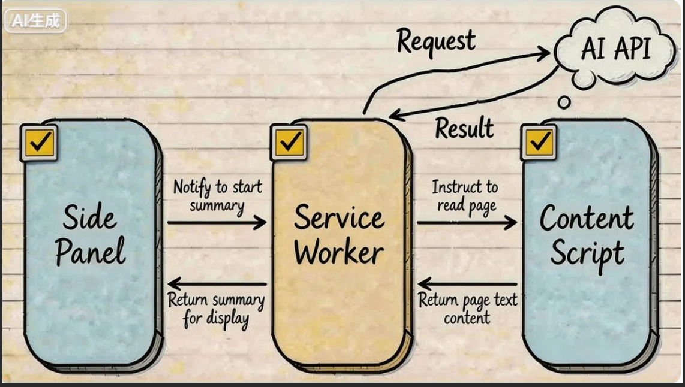
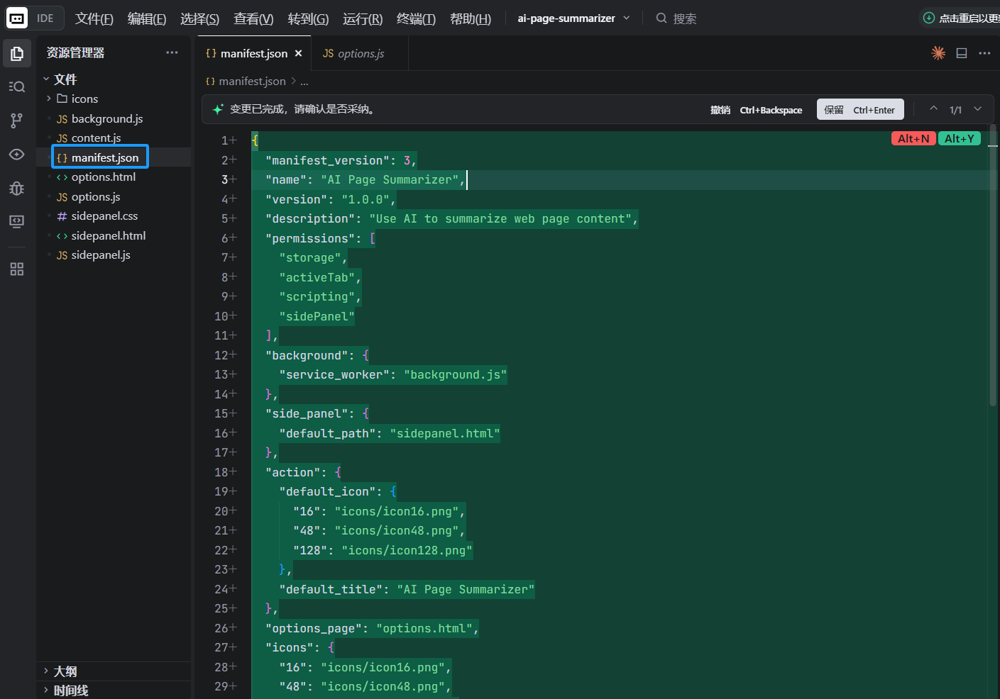
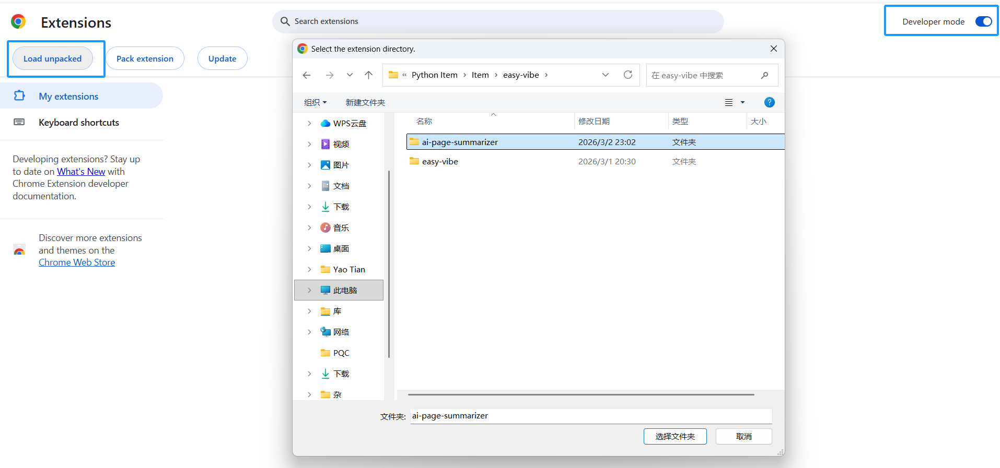
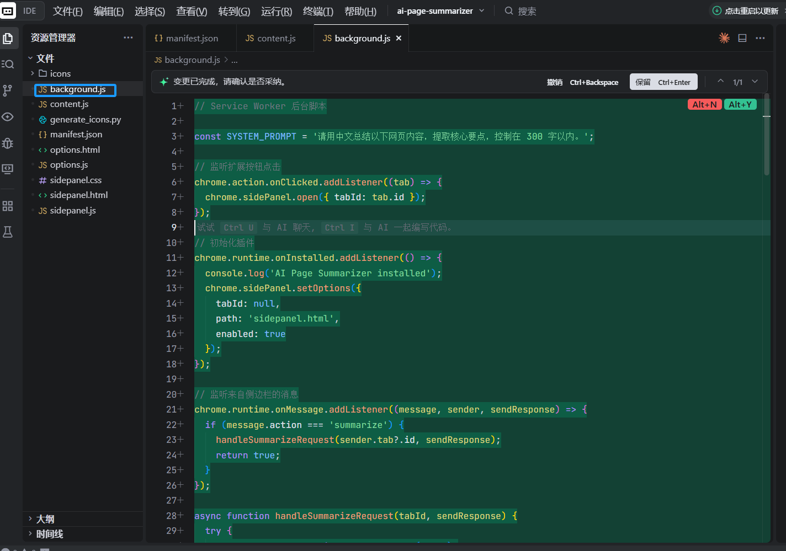
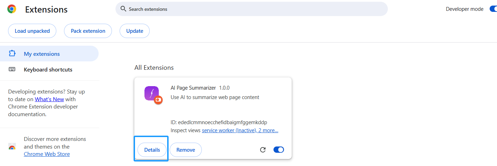
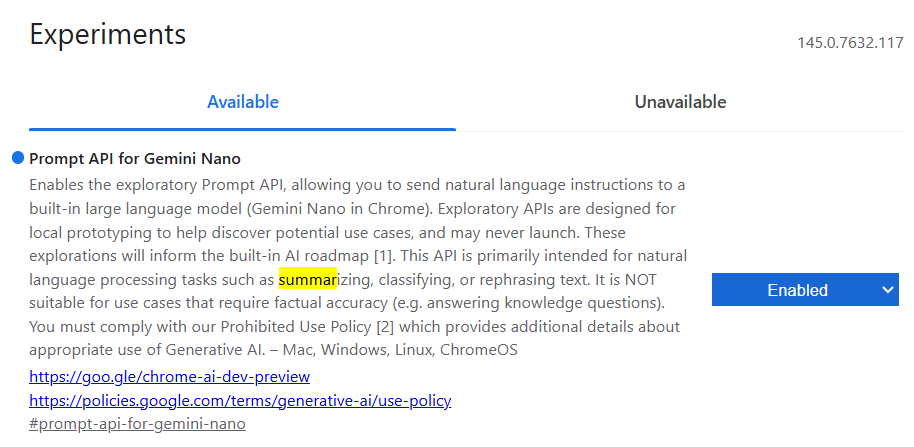
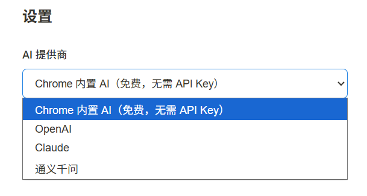
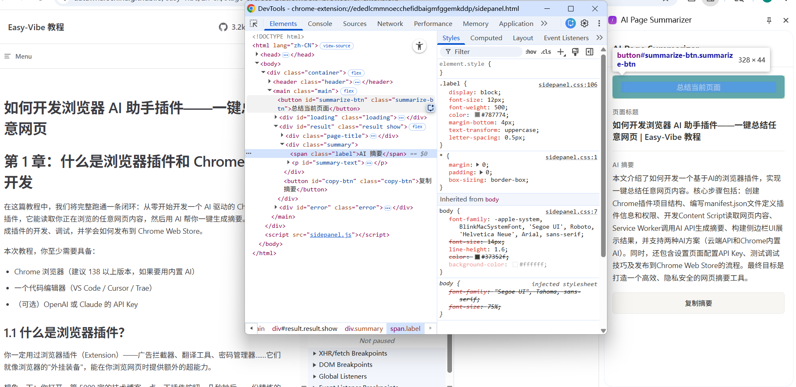
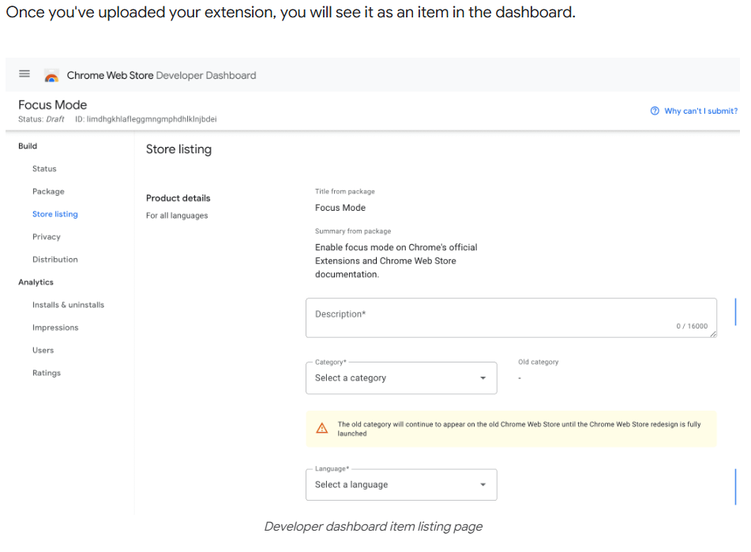

# 如何开发浏览器 AI 助手插件——一键总结任意网页

# 第 1 章：什么是浏览器插件和 Chrome 插件开发

在这篇教程中，我们将完整跑通一条闭环：从零开始开发一个 AI 驱动的 Chrome 浏览器插件，它能读取你正在浏览的任意网页内容，然后用 AI 帮你一键生成摘要。你会亲手完成插件的开发、调试，并学会如何发布到 Chrome Web Store。

本次教程，你至少需要具备：

- Chrome 浏览器（建议 138 以上版本，如果要用内置 AI）
- 一个代码编辑器（VS Code / Cursor / Trae）
- （可选）OpenAI 或 Claude 的 API Key

## 1.1 什么是浏览器插件？

你一定用过浏览器插件（Extension）——广告拦截器、翻译工具、密码管理器……它们就像浏览器的"外挂装备"，能在你浏览网页时提供额外的超能力。

想象一下：你打开一篇 5000 字的技术博客，点一下插件按钮，几秒钟后，一份精炼的中文摘要就出现在侧边栏里。这就是我们要构建的东西。


<!--  -->

## 1.2 Chrome 插件的基本架构

Chrome 插件（基于 Manifest V3）由几个核心部分组成，它们各司其职：

* **Manifest 文件（manifest.json）**：插件的"身份证"，声明插件的名称、权限、入口文件等。
* **Service Worker（后台脚本）**：插件的"大脑"，在后台处理事件、调用 API。它不是一直运行的，而是按需启动。
* **Content Script（内容脚本）**：插件的"眼睛"，注入到网页中，能读取页面的 DOM 内容。
* **Side Panel（侧边栏）**：插件的"脸面"，在浏览器右侧展示 UI，用户在这里看到 AI 的总结结果。
* **Options Page（设置页）**：让用户配置 API Key 等参数。

它们之间的协作流程是这样的：

``` 
用户点击插件图标
    → 侧边栏打开
    → 用户点击"总结"按钮
    → 侧边栏通知 Service Worker
    → Service Worker 让 Content Script 去读取页面文字
    → Content Script 返回页面内容
    → Service Worker 把内容发给 AI API
    → AI 返回摘要
    → Service Worker 把摘要发回侧边栏显示
```

<!--  -->

## 1.3 两种 AI 方案：云端 API vs 浏览器内置 AI

我们的插件有两种获取 AI 能力的方式：

**方案 A：调用云端 AI API（OpenAI / Claude）**

* 优点：模型能力强大，支持所有设备
* 缺点：需要 API Key，需要联网，有使用成本
* 适合：追求高质量摘要、需要处理复杂内容

**方案 B：使用 Chrome 内置 AI（Summarizer API）**

从 Chrome 138 开始，Google 在浏览器中内置了基于 Gemini Nano 的 AI 能力，其中就包括 **Summarizer API**——完全在本地运行，不需要 API Key，不需要联网，完全免费。

* 优点：免费、隐私安全、无需 API Key
* 缺点：需要 Chrome 138+、需要较好的硬件（4GB+ 显存或 16GB+ 内存）、模型能力不如云端
* 适合：注重隐私、不想花钱、硬件条件允许

**本教程将同时实现两种方案**，你可以根据自己的情况选择。

## 1.4 本教程的路线图

我们将从零构建一个名为 **"AI Page Summarizer"** 的 Chrome 插件，按以下步骤完成：

1. **搭建插件骨架**：创建 Manifest V3 项目结构，加载到 Chrome 中
2. **实现核心功能**：Content Script 读取页面 + Service Worker 调用 AI API + 侧边栏展示结果
3. **接入 Chrome 内置 AI**：使用 Summarizer API 实现免费本地总结
4. **测试与调试**：掌握 Chrome 插件的调试技巧
5. **发布到 Chrome Web Store**：打包并提交审核

# 第 2 章：搭建插件骨架

## 2.1 创建项目结构

打开你的 AI 编程助手（Cursor / Trae / Claude Code），新建一个空文件夹 `ai-page-summarizer`，然后在对话框中输入：

```
请帮我创建一个 Chrome 浏览器插件项目，使用 Manifest V3。
项目名叫 ai-page-summarizer，功能是用 AI 总结网页内容。
请创建以下文件结构：

ai-page-summarizer/
├── manifest.json          # MV3 清单文件
├── background.js          # Service Worker 后台脚本
├── content.js             # 内容脚本（读取页面文字）
├── sidepanel.html         # 侧边栏 HTML
├── sidepanel.js           # 侧边栏逻辑
├── sidepanel.css          # 侧边栏样式
├── options.html           # 设置页面
├── options.js             # 设置页面逻辑
└── icons/                 # 图标文件夹

manifest.json 的要求：
1. manifest_version: 3
2. 权限：storage, activeTab, scripting, sidePanel
3. 后台使用 service_worker: "background.js"
4. 配置 side_panel，默认路径为 sidepanel.html
5. action 配置默认图标和标题
```

AI 会帮你生成完整的项目骨架。让我们逐个看看每个文件的作用。

## 2.2 manifest.json——插件的"身份证"

这是 Chrome 插件最重要的文件，它告诉浏览器这个插件是什么、需要什么权限、有哪些组件：

```json
{
  "manifest_version": 3,
  "name": "AI Page Summarizer",
  "version": "1.0",
  "description": "用 AI 一键总结任意网页内容",
  "permissions": ["storage", "activeTab", "scripting", "sidePanel"],
  "background": {
    "service_worker": "background.js"
  },
  "action": {
    "default_title": "AI Page Summarizer",
    "default_icon": {
      "16": "icons/icon-16.png",
      "48": "icons/icon-48.png",
      "128": "icons/icon-128.png"
    }
  },
  "side_panel": {
    "default_path": "sidepanel.html"
  },
  "options_page": "options.html",
  "icons": {
    "16": "icons/icon-16.png",
    "48": "icons/icon-48.png",
    "128": "icons/icon-128.png"
  }
}
```

**权限解读：**

* `storage`：允许插件存储数据（比如用户的 API Key）
* `activeTab`：允许插件访问用户当前正在看的标签页（仅在用户点击插件时生效，非常安全）
* `scripting`：允许插件向页面注入脚本来读取内容
* `sidePanel`：允许使用 Chrome 侧边栏 API


<!--  -->

## 2.3 准备图标

Chrome 插件需要三个尺寸的图标：16x16、48x48、128x128。你可以让 AI 帮你生成：

```
请帮我生成三个简单的 Chrome 插件图标（16x16、48x48、128x128），
设计风格：圆角矩形，渐变紫色背景，中间一个白色的 AI 闪电符号。
保存到 icons/ 目录下，分别命名为 icon-16.png、icon-48.png、icon-128.png。
```

## 2.4 加载插件到 Chrome

在写代码之前，我们先把这个"空壳"插件加载到 Chrome 里，这样后续每次修改都能实时看到效果：

1. 打开 Chrome，地址栏输入 `chrome://extensions/`
2. 打开右上角的 **"开发者模式"** 开关
3. 点击 **"加载已解压的扩展程序"**
4. 选择你的 `ai-page-summarizer` 文件夹

你会看到插件出现在列表中，右上角的工具栏也会多出一个图标。



<!--  -->

> **提示**：每次修改代码后，回到 `chrome://extensions/` 页面，点击插件卡片上的 **刷新按钮（🔄）** 即可更新。

# 第 3 章：实现核心功能——读取页面 + AI 总结

## 3.1 Content Script：读取页面文字

Content Script 是注入到网页中的脚本，它能直接访问页面的 DOM。我们用它来提取页面的文字内容。

让 AI 帮你编写 `content.js`：

```
请帮我编写 content.js，功能是：
1. 监听来自 Service Worker 的消息
2. 当收到 "getPageContent" 消息时，提取当前页面的文字内容
3. 提取逻辑：获取 document.body.innerText，同时获取页面标题和 URL
4. 将提取的内容通过 sendResponse 返回
```

AI 会生成类似这样的代码：

```javascript
// content.js
chrome.runtime.onMessage.addListener((request, sender, sendResponse) => {
  if (request.action === 'getPageContent') {
    const content = document.body.innerText || document.body.textContent
    sendResponse({
      content: content.trim(),
      title: document.title,
      url: window.location.href
    })
  }
  return true // 保持消息通道开放
})
```

## 3.2 Service Worker：调用 AI API

Service Worker 是插件的"大脑"，负责协调各个组件之间的通信，以及调用外部 AI API。

让 AI 帮你编写 `background.js`：

```
请帮我编写 background.js，功能是：
1. 当用户点击插件图标时，打开侧边栏
2. 监听来自侧边栏的 "summarize" 消息
3. 收到消息后，向当前标签页的 content script 发送 "getPageContent" 消息获取页面内容
4. 拿到页面内容后，从 chrome.storage.local 读取用户配置的 API Key 和模型选择
5. 根据配置调用对应的 AI API（支持 OpenAI 和 Claude）
6. 将 AI 返回的摘要发送回侧边栏

对于 OpenAI，调用 https://api.openai.com/v1/chat/completions，模型用 gpt-4o-mini
对于 Claude，调用 https://api.anthropic.com/v1/messages，模型用 claude-sonnet-4-20250514
系统提示词：请用中文总结以下网页内容，提取核心要点，控制在 300 字以内。
```

核心代码片段如下：

```javascript
// background.js

// 点击图标时打开侧边栏
chrome.sidePanel.setPanelBehavior({ openPanelOnActionClick: true })

// 监听来自侧边栏的消息
chrome.runtime.onMessage.addListener((request, sender, sendResponse) => {
  if (request.action === 'summarize') {
    handleSummarize(request.tabId).then(sendResponse)
    return true // 异步响应
  }
})

async function handleSummarize(tabId) {
  // 1. 获取页面内容
  const [response] = await chrome.tabs.sendMessage(tabId, {
    action: 'getPageContent'
  })

  // 2. 读取用户配置
  const { apiKey, provider } = await chrome.storage.local.get([
    'apiKey', 'provider'
  ])

  if (!apiKey) {
    return { error: '请先在设置页面配置 API Key' }
  }

  // 3. 调用 AI API
  const summary = provider === 'claude'
    ? await callClaude(response.content, apiKey)
    : await callOpenAI(response.content, apiKey)

  return { summary, title: response.title }
}
```


<!--  -->

## 3.3 侧边栏 UI：展示总结结果

侧边栏是用户与插件交互的主界面。让 AI 帮你编写侧边栏的 HTML、CSS 和 JS：

```
请帮我编写侧边栏的三个文件：

sidepanel.html：
- 顶部显示插件名称 "AI Page Summarizer"
- 一个蓝色的 "总结当前页面" 按钮
- 一个加载动画区域（默认隐藏）
- 一个结果展示区域，显示页面标题和 AI 摘要
- 底部有一个 "复制摘要" 按钮

sidepanel.css：
- 简洁现代的设计风格，类似 Notion 的排版
- 宽度自适应侧边栏
- 按钮有 hover 效果
- 加载动画用 CSS 实现

sidepanel.js：
- 点击 "总结" 按钮时，获取当前标签页 ID
- 向 background.js 发送 summarize 消息
- 显示加载动画
- 收到结果后隐藏加载动画，展示摘要
- "复制" 按钮使用 navigator.clipboard.writeText 复制文字
```


<!--  -->

## 3.4 设置页面：配置 API Key

用户需要一个地方来输入自己的 API Key。让 AI 帮你编写设置页面：

```
请帮我编写 options.html 和 options.js：
- 一个下拉选择框，选择 AI 提供商（OpenAI / Claude）
- 一个密码输入框，输入 API Key（type="password"）
- 一个 "保存" 按钮
- 保存时使用 chrome.storage.local.set 存储配置
- 页面加载时从 storage 读取已保存的配置并回填
- 保存成功后显示 "设置已保存" 的提示
```

> **安全提醒**：API Key 存储在 `chrome.storage.local` 中，仅在本地设备上保存。但如果你要发布到 Chrome Web Store 供他人使用，更安全的做法是搭建一个后端代理服务器，避免 API Key 直接暴露在客户端。




<!--  -->

# 第 4 章：使用 Chrome 内置 AI（无需 API Key）

从 Chrome 138 开始，Google 在浏览器中内置了基于 **Gemini Nano** 的 AI 能力，其中最适合我们场景的就是 **Summarizer API**——完全在本地运行，不需要 API Key，不需要联网，完全免费。

## 4.1 检查浏览器是否支持

内置 AI 有硬件要求：

* 桌面端 Chrome 138+（Windows 10+、macOS 13+、Linux、ChromeOS）
* 22 GB 可用存储空间（需要下载模型）
* GPU 显存 4GB 以上，或 CPU 内存 16GB 以上且 4 核以上

在 Chrome 地址栏输入 `chrome://flags`，搜索对应关联Summarization的flag，确保它是 **Enabled** 状态。
* 在 Chrome 131–137 版本中，该开关为 Summarization API。
* 在 Chrome 138–144 版本中，该开关更名为 Summarization API for Gemini Nano。
* 在 Chrome 145+ 版本中，Summarization API for Gemini Nano 已被移除，其总结功能已整合到 Prompt API for Gemini Nano


<!--  -->

## 4.2 使用 Summarizer API

让 AI 帮你在 `background.js` 中添加内置 AI 的支持：

```
请帮我在 background.js 中添加 Chrome 内置 Summarizer API 的支持：
1. 添加一个 summarizeWithBuiltinAI 函数
2. 先检查 Summarizer.availability() 是否返回 'readily-available'
3. 如果可用，创建 summarizer 实例，配置 type 为 'key-points'，format 为 'markdown'，length 为 'medium'
4. 调用 summarizer.summarize() 进行总结
5. 在 handleSummarize 函数中，增加一个 provider === 'builtin' 的分支
```

核心代码：

```javascript
async function summarizeWithBuiltinAI(text) {
  // 检查是否可用
  const availability = await Summarizer.availability()
  if (availability !== 'readily-available') {
    throw new Error('Chrome 内置 AI 不可用，请检查浏览器版本和硬件要求')
  }

  // 创建总结器
  const summarizer = await Summarizer.create({
    type: 'key-points',
    format: 'markdown',
    length: 'medium'
  })

  // 执行总结
  const summary = await summarizer.summarize(text, {
    context: '这是一篇网页文章'
  })

  return summary
}
```

## 4.3 更新设置页面

在 `options.html` 的 AI 提供商下拉框中，增加一个 **"Chrome 内置 AI（免费）"** 选项。当用户选择这个选项时，隐藏 API Key 输入框（因为不需要）。

```
请帮我修改 options.html 和 options.js：
1. 在 AI 提供商下拉框中增加选项 "Chrome 内置 AI（免费，无需 API Key）"，value 为 "builtin"
2. 当选择 builtin 时，隐藏 API Key 输入框
3. 当选择 OpenAI 或 Claude 时，显示 API Key 输入框
```


<!--  -->

# 第 5 章：测试与调试

## 5.1 本地测试流程

开发 Chrome 插件的调试方式和普通网页略有不同：

**调试 Service Worker：**
1. 打开 `chrome://extensions/`
2. 找到你的插件，点击 **"Service Worker"** 链接
3. 会打开一个专门的 DevTools 窗口，可以看到 console.log 输出和网络请求

**调试侧边栏：**
1. 打开侧边栏后，右键点击侧边栏内容
2. 选择 **"检查"**（Inspect）
3. 会打开侧边栏的 DevTools

**调试 Content Script：**
1. 在任意网页上按 F12 打开 DevTools
2. 在 Console 面板中，点击左上角的下拉框，选择你的插件名称
3. 就能看到 Content Script 的 console 输出


<!--  -->

## 5.2 常见问题排查

| 问题 | 可能原因 | 解决方法 |
|------|---------|---------|
| 点击图标没反应 | Service Worker 报错 | 检查 Service Worker 的 DevTools Console |
| 获取不到页面内容 | Content Script 未注入 | 刷新页面后重试，检查 manifest 中的 matches 配置 |
| API 调用失败 | API Key 错误或过期 | 在设置页面重新输入 API Key |
| 侧边栏空白 | sidepanel.html 路径错误 | 检查 manifest 中的 side_panel.default_path |


# 第 6 章：发布到 Chrome Web Store（可选）

如果你想把插件分享给其他人使用，可以发布到 Chrome Web Store。

## 6.1 发布准备

1. **注册开发者账号**：访问 [Chrome Web Store Developer Dashboard](https://chrome.google.com/webstore/devconsole)，支付一次性 $5 美元注册费
2. **开启两步验证**：Google 账号必须开启两步验证才能发布插件
3. **准备素材**：
   * 插件图标：128x128 PNG
   * 至少一张截图：推荐 1280x800 像素
   * 详细的功能描述
   * 隐私政策说明（如果你的插件处理用户数据）

## 6.2 打包与上传

1. 将插件文件夹打包为 `.zip` 文件（不是 `.crx`）
2. 在 Developer Dashboard 中点击 **"New Item"**
3. 上传 `.zip` 文件
4. 填写商店信息（名称、描述、截图、分类等）
5. 填写隐私实践（声明你的插件收集了哪些数据）
6. 点击 **"Submit for Review"**

Google 会对提交的插件进行审核，通常需要几个工作日。权限越少、描述越清晰，审核通过越快。




<!--  -->

# 第 7 章：写在最后

恭喜你！你已经从零构建了一个 AI 驱动的浏览器插件。回顾一下我们做了什么：

1. 理解了 Chrome 插件的 Manifest V3 架构
2. 用 Content Script 读取网页内容
3. 用 Service Worker 调用 AI API 生成摘要
4. 用 Side Panel 展示总结结果
5. 还学会了使用 Chrome 内置 AI（无需 API Key）

浏览器插件是一个非常有趣的开发领域——它让你能够"增强"互联网上的任何网页。除了总结页面，你还可以用类似的架构做很多事情：

**进阶方向：**

* **翻译助手**：一键将外文网页翻译成中文
* **阅读标注**：在网页上高亮和批注，保存到云端
* **价格追踪**：监控电商网页的价格变化并提醒
* **代码解释器**：在 GitHub 上选中代码，AI 自动解释

Chrome 内置 AI 的出现更是降低了门槛——你甚至不需要 API Key 就能构建 AI 驱动的插件。随着浏览器 AI 能力的不断增强，这个领域的想象空间会越来越大。

***去给你的浏览器装上超能力吧！***

# 参考文献

* [Chrome Extension 官方文档 - Manifest V3](https://developer.chrome.com/docs/extensions/develop/)
* [Chrome Extension 在 Chrome 应用商店中发布](https://developer.chrome.com/docs/webstore/publish?hl=zh-cn)
* [Chrome Side Panel API](https://developer.chrome.com/docs/extensions/reference/api/sidePanel)
* [Chrome 内置 AI - Summarizer API](https://developer.chrome.com/docs/ai/summarizer-api)
* [Chrome 内置 AI - Prompt API](https://developer.chrome.com/docs/ai/prompt-api)
* [OpenAI API 文档](https://platform.openai.com/docs/api-reference)
* [Anthropic Claude API 文档](https://docs.anthropic.com/en/docs/)
* [Anthropic Claude API 文档](https://developer.chrome.com/docs/webstore/publish?hl=zh-cn)

